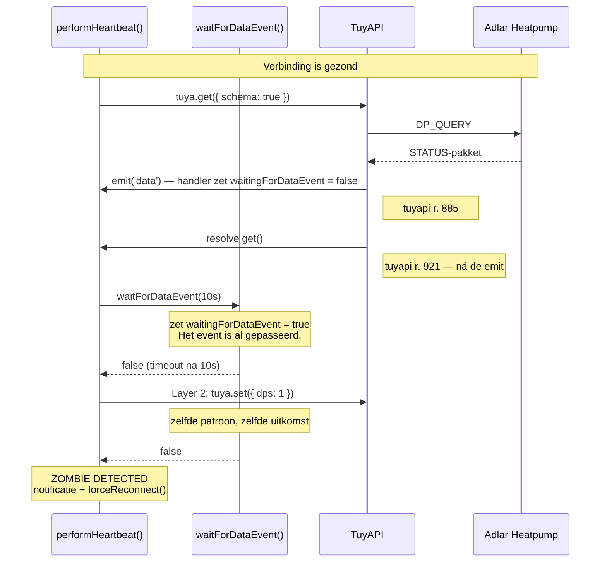
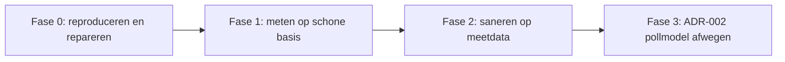

# Technisch Onderzoeksverslag: Tuya Zombie-Connecties en Defensieve Mechanismen

- **Auteur**: Antigravity / Pair Programming
- **Datum**: 2026-08-22
- **Doelsysteem**: `org.hhi.adlar-heatpump` — [`lib/tuya/services/tuya-connection-service.ts`](../../lib/tuya/services/tuya-connection-service.ts), TuyAPI v7.7.1
- **Status**: Concept. De defecten in §3 zijn code-geverifieerd; de impactschatting in §7 en de aanbevelingen in §8 vragen nog om meting.
- **Revisies**: zie [Bijlage A](#bijlage-a--wijzigingen-ten-opzichte-van-v1)

> **Naamgeving nog open**: de bestandsnaam belooft een defensiestrategie, maar die staat inmiddels in [ADR-003](ADR-003-TUYA-ZOMBIE-DETECTIE-EN-DEFENSIEVE-LAGEN.md). Dit is een diagnosedocument geworden. Hernoemen naar `TUYA-ZOMBIE-DIAGNOSE.md` kan met `git mv`; alleen ADR-002 en ADR-003 verwijzen ernaar. Bewust niet uitgevoerd — mogelijk bestaan er externe verwijzingen.

---

## 1. Managementsamenvatting

Aanleiding voor dit onderzoek was het regelmatig verschijnen van "Zombie Verbinding Gedetecteerd"-meldingen, en de vraag of de defensieve lagen in de Tuya-driver elkaar in de weg zitten.

**Het antwoord op die vraag is grotendeels nee.** De lagen overlappen, maar de meldingen komen niet uit die overlap voort. Ze komen uit **drie defecten** die stuk voor stuk in de broncode aantoonbaar zijn:

| # | Defect | Gevolg | Detail |
|---|---|---|---|
| 1 | `waitForDataEvent()` opent zijn wachtvenster ná de `get()` die het moet meten | Layer 1 en 2 melden vrijwel altijd "zombie", ook op een gezonde verbinding | §3.1 |
| 2 | De `dp-refresh`-handler werkt de zombie-velden niet bij | Gedeeltelijke DPS-updates tellen voor géén enkele data-event-controle mee | §3.2 |
| 3 | TuyAPI's `_pingPongTimeout` blijft na `disconnect()` staan | Native ping-detectie valt uit zolang er geen pong komt — juist in het zombie-geval | §3.3 |

Defect 1 is de dominante bron: het produceert de melding op een verbinding die aantoonbaar werkt.

**Wat dat betekent voor de volgorde van werken**: elke conclusie over "welke laag mag weg" of "hoeveel zombies zijn er echt" is onbetrouwbaar zolang deze defecten bestaan. Repareren gaat vóór meten, meten gaat vóór saneren. Zie §8.

**Wat dat betekent voor [ADR-002](ADR-002-TUYA-VERBINDINGSMODEL.md)**: de meetfase daar stelt de vraag "welk aandeel van de disconnects is zombie versus clean?" en gebruikt het antwoord om een herschrijving van 800 à 1200 regels te rechtvaardigen. Met defect 1 actief valt dat antwoord onvermijdelijk uit op "overwegend zombie". Die ADR is daarom expliciet geblokkeerd tot de reparatie rond is.

**Twee dingen die dit verslag nog niet weet**: hoe vaak de meldingen feitelijk optreden (§7.2 beschrijft de goedkoopste manier om dat vast te stellen), en of het repareren van defect 1 een echte zombie langer laat voortduren (§7.3 — een reëel regressierisico).

---

## 2. Wat is een zombie-connectie?

De Tuya-driver werkt met een **permanente TCP-socket** (`net.Socket`) en push-events. Een verbinding is een *echte* zombie wanneer twee dingen tegelijk gelden:

- **Lokale toestand**: Homey beschouwt de verbinding als actief (`isConnected === true`, socket `readyState === 'open'`).
- **Functionele toestand**: er vloeit geen applicatiedata meer; commando's komen niet aan en statuswijzigingen worden niet ontvangen.

Daarnaast bestaat er een **gerapporteerde** zombie: de detectielogica concludeert een zombie terwijl de verbinding functioneert. §3 laat zien dat de huidige implementatie die tweede categorie structureel produceert — en dat het onderscheid tussen beide op dit moment niet te maken is uit de logs.

Zo ontstaat de gerapporteerde zombie (defect 1). Let op de volgorde: het data-event komt wél binnen, maar vóórdat er iemand op wacht.



---

## 3. De drie bevestigde defecten

Deze defecten zijn direct in de broncode aantoonbaar en vragen geen productiemeting om vastgesteld te worden — alleen om hun *frequentie* te kwantificeren (§7).

### 3.1 `waitForDataEvent()` kan het event per definitie niet zien

**Locatie**: `performHeartbeat()` (r. 1467), aanroepen op r. 1603 en r. 1649; `waitForDataEvent()` op r. 1736.

De heartbeat doet dit:

```typescript
await Promise.race([this.tuya.get({ schema: true }), /* timeout */]);   // (1)
// ...
const layer1DataEventReceived = await this.waitForDataEvent(            // (2)
  DeviceConstants.HEARTBEAT_DATA_EVENT_TIMEOUT_MS,
);
```

En `waitForDataEvent()` begint met:

```typescript
this.waitingForDataEvent = true;   // pas hier gaat de vlag aan
```

TuyAPI verwerkt de binnenkomende STATUS-response in deze volgorde ([`tuyapi/index.js`](../../node_modules/tuyapi/index.js)):

1. r. 885 — `this.emit('data', packet.payload, ...)`
2. r. 920-921 — `this._resolvers[packet.sequenceN](packet.payload)` → hierdoor resolvet `get()`

`emit()` is synchroon, dus onze `data`-handler (r. 1095-1128) heeft `waitingForDataEvent` al op `false` gezet (r. 1114) op het moment dat regel (1) terugkeert. Regel (2) zet de vlag daarna op `true` en wacht tien seconden op een event dat niet nóg een keer komt.

**Gevolg**: Layer 1 rapporteert "OK but NO data event" bij elke probe. De enige ontsnapping is een spontane DPS-update die toevallig binnen het venster valt — en omdat de heartbeat alleen draait wanneer er al ruim twee minuten geen data was, is die kans klein. Layer 2 stuurt vervolgens een `set()` en faalt om exact dezelfde reden. Daarna volgt onvoorwaardelijk het `ZOMBIE DETECTED`-blok (r. 1661), inclusief pushnotificatie (r. 1681) en `forceReconnect()` of `reinitialize()` (r. 1689-1694) — terwijl er seconden eerder nog verse DPS-data binnenkwam.

**Bewijs uit de eigen codebase**: dezelfde controle staat twee keer wél correct in het bestand, met een timestamp die *vóór* de query wordt vastgelegd:

- `verifyConnectionHealth()` (r. 487): `const preQueryDataTime = this.lastDataEventReceived;` … daarna vergelijken.
- `startPeriodicDpsRefresh()` (r. 1360): `const preRefreshDataTime = this.lastDataEventReceived;` … daarna vergelijken.

Drie implementaties van dezelfde vraag, één daarvan kapot — en juist die ene stuurt de zombie-escalatie aan. §7.1 bevat een test die dit vastlegt.

### 3.2 De `dp-refresh`-handler werkt de zombie-velden niet bij

**Locatie**: `setupTuyaEventHandlers()` — `data`-handler r. 1095-1128, `dp-refresh`-handler r. 1131-1144.

| Veld | `data`-handler | `dp-refresh`-handler |
|---|---|---|
| `lastDataEventTime` | ✅ bijgewerkt | ✅ bijgewerkt |
| `lastDataEventReceived` | ✅ bijgewerkt | ❌ **niet** bijgewerkt |
| `waitingForDataEvent` | ✅ op `false` gezet | ❌ **niet** aangeraakt |
| `zombieRecoveryAttempts` | ✅ gereset | ❌ **niet** gereset |

TuyAPI zendt `dp-refresh` uit wanneer een STATUS-pakket binnenkomt waarin `dps[1]` ontbreekt ([`tuyapi/index.js`](../../node_modules/tuyapi/index.js) r. 861-872), en beantwoordt een lege DP_REFRESH-response volledig zonder event (r. 826-858).

**Gevolg**: voor een pomp die overwegend gedeeltelijke DPS-updates stuurt, faalt niet alleen `waitForDataEvent()`, maar falen óók de twee correcte implementaties uit §3.1 — die kijken immers naar `lastDataEventReceived`. Dit is een tweede, onafhankelijke bron van valse zombies en van mislukte `verifyConnectionHealth()`-checks na een reconnect.

De stale-check (§6.3) gebruikt `lastDataEventTime` en wordt hier dus **niet** door geraakt.

### 3.3 TuyAPI's ping-timeout raakt ontwapend zolang er geen pong binnenkomt

**Locatie**: [`tuyapi/index.js`](../../node_modules/tuyapi/index.js) r. 95-99, r. 501-525, r. 803-815, r. 938-960.

```javascript
// _sendPing(), r. 514
if (this._pingPongTimeout === null) {
  this._pingPongTimeout = setTimeout(() => { /* … disconnect() … */ },
                                     this._responseTimeout * 1000);
} else {
  debug('There was no response to the last ping.');   // geen nieuwe timeout
}

// disconnect(), r. 944-945
clearInterval(this._pingPongInterval);
clearTimeout(this._pingPongTimeout);   // handle wordt NIET op null gezet
```

`_pingPongTimeout` wordt uitsluitend op `null` gezet in de constructor (r. 98) en bij ontvangst van een pong (r. 811). `disconnect()` doet wél `clearTimeout()` maar laat de handle staan. Op een hergebruikte instance wordt de ping nog steeds verstuurd (r. 526), maar er wordt **geen nieuwe timeout gearmeerd** zolang de handle niet `null` is.

Dat is niet permanent — en juist daardoor gevaarlijk:

| Situatie na hergebruik van de instance | Gevolg |
|---|---|
| Herverbinding lukt, apparaat pongt | Handle wordt binnen ±10s `null`; native timeout weer actief. Onschadelijk. |
| Herverbinding levert een stille socket op | Handle blijft non-null; TuyAPI armeert nooit een timeout en vuurt dus **nooit** `disconnected`. Layer 0 (35s) is de enige detector. |

De ontwapening treft dus uitgerekend het scenario waarvoor de detectie bedoeld is. Voorwaarde is dat de handle bij de vorige `disconnect()` non-null was — wat per definitie zo is bij een disconnect die door de ping-timeout zélf is veroorzaakt.

**Aan onze kant** wordt de instance op twee manieren hergebruikt:

```typescript
// r. 463 — de wrapper nulld alleen als isConnected nog true is
async disconnect(): Promise<void> {
  if (this.tuya && this.isConnected) {   // <-- guard
    // …
    this.tuya = null;
  }
}
```

Layer 0 zet `isConnected = false` (r. 1322) **vóórdat** het herstelpad loopt, dus de guard is onwaar en `connectTuya()` (r. 322, recreatie alleen `if (!this.tuya)` op r. 330) hergebruikt dezelfde instance. Daarnaast omzeilt `attemptReconnectionWithRecovery()` de wrapper volledig:

```typescript
// r. 2004-2014 — FIX 1: Force disconnect to reset TuyAPI internal state
if (this.tuya) {
  try {
    await this.tuya.disconnect();   // wrapper overgeslagen; this.tuya blijft staan
  } catch (err) { /* … */ }
}
```

Dat is het pad dat bij élke geplande herverbinding loopt. Een oplossing die alleen de wrapper aanpast, mist het.

**Conclusie**: de aanname dat Layer 0 "dezelfde pong opnieuw controleert en dus redundant is" gaat niet op. In het stille-socket-scenario is Layer 0 de enige overgebleven detector.

---

## 4. Condities: echte versus gerapporteerde zombies

| Conditie | Laag | Oorzaak | Type |
|---|---|---|---|
| **A. Ordeningsfout in `waitForDataEvent`** | Applicatie | Het `data`-event vuurt vóór de resolve van `get()`; het wachtvenster opent daarna. | **Gerapporteerd** — zie §3.1 |
| **B. `dp-refresh`-antwoordpad** | Applicatie | Antwoord komt binnen als `dp-refresh` of als lege DP_REFRESH-response; de zombie-velden blijven ongemoeid. | **Gerapporteerd** — zie §3.2 |
| **C. Wi-Fi latency / buitenunit** | Netwerk | Packet loss of latency boven de 10 seconden door afstand tot de buitenunit. | **Gerapporteerd** |
| **D. Half-open TCP-socket** | Transport | NAT-tabel herstart, AP-roaming of DHCP-renew zonder `FIN`/`RST`. | **Echt** |
| **E. Tuya MCU firmware hang** | Device | Wi-Fi-module beantwoordt TCP ACKs, maar de link naar de pompcontroller hangt. | **Echt** |
| **F. Ontwapende native ping-timeout** | Bibliotheek | `_pingPongTimeout` blijft een stale handle; geen pong betekent geen nieuwe timeout. | **Echt, langer onopgemerkt** — zie §3.3 |

A en B zijn deterministisch en verklaren vermoedelijk het leeuwendeel van de meldingen. Hoeveel precies is nog niet vastgesteld — zie §7.2.

---

## 5. Relatie met het Tuya `disconnected`-event

### 5.1 Wanneer treedt het op?

TuyAPI vuurt `emit('disconnected')` in precies drie situaties:

1. **Native ping-pong timeout** (r. 514-520): elke 10 seconden een leeg `HEART_BEAT` (0x09); geen pong binnen 2 seconden (`_responseTimeout`) betekent direct `this.disconnect()`. **Alleen actief zolang `_pingPongTimeout === null` bij het versturen van de ping** — zie §3.3.
2. **Socket `close`-event** (r. 699-703): router of pomp sluit de sessie met `FIN` of `RST`, of Node.js sluit na een socketfout.
3. **Expliciete aanroep**: onze eigen code roept `this.tuya.disconnect()` aan.

### 5.2 Zombie versus disconnect

| Eigenschap | `disconnected`-event | Zombie-toestand |
|---|---|---|
| **Detectiesnelheid** | Circa 12s voor één gemiste pong — mits de timeout gearmeerd is | Layer 0 na 35s; stale-check na 15 min |
| **OS socket status** | Gesloten (`CLOSED` / `DESTROYED`) | Open (`ESTABLISHED`) |
| **TuyAPI kennis** | TuyAPI weet dat de socket dood is | TuyAPI veronderstelt dat de socket leeft |
| **Oorzaak** | Schone netwerkonderbreking of ping-timeout | Vastgelopen MCU-stack, half-open NAT-route, of ontwapende ping-timeout |
| **Vangnet** | `tuya.on('disconnected')`-handler | Layer 0 (35s), de stale-check in de 20s health loop (§6.3), en de 5-minutenprobe |

> Een zombie is per definitie een toestand **waarin geen disconnect-event is opgetreden**. Vuurt TuyAPI wél `disconnected`, dan grijpt de normale handler in en is zombie-detectie overbodig. Het omgekeerde geldt niet: het uitblijven van een disconnect-event bewijst niet dat TuyAPI nog actief bewaakt (§3.3).

---

## 6. Evaluatie van de detectie- en herstelmechanismen

### 6.1 Inventaris

Eerdere documenten spreken van "11 defensieve lagen". Dat aantal is retorisch: het telt detectie en herstel door elkaar. Uitgesplitst zijn het **vijf detectiemechanismen** en **drie herstelmechanismen**.

**Detectie** — merken dát er iets mis is:

| Mechanisme | Interval | Meet |
|---|---|---|
| TuyAPI native ping/pong | 10s ping, 2s timeout | Socket-liveness |
| Layer 0: native-heartbeat-watchdog | 10s check, 35s drempel | Socket-liveness (via dezelfde pong) |
| Deep socket error handler | event-gedreven | `ECONNRESET` op `tuya.client` |
| OS TCP keep-alive | 5 min | Socket-liveness (kernelniveau) |
| Layer 1-2: actieve probe | 5 min | Request/response + dataversheid |
| Layer 3: stale-check | 20s check, 15 min drempel | Dataversheid (§6.3) |
| Periodieke DPS-refresh | 15 min | Request/response + dataversheid |

**Herstel** — wat er gebeurt ná detectie:

| Mechanisme | Rol |
|---|---|
| Exponential backoff & circuit breaker | 20s–300s backoff, 5 min cooldown met DNS-check |
| Progressive wake-up strategy | Na 5 mislukte pogingen `set()` vóór `find()` |
| ADR-026 zombie recovery escalation | 1e poging `forceReconnect`, 2e `reinitialize` |

### 6.2 Waar zitten de mechanismen elkaar werkelijk in de weg?

1. **De `waitForDataEvent()`-val is het dominante probleem** — en dat is geen overlapprobleem maar een defect (§3.1). Layer 1 en 2 verklaren een gezonde verbinding dood en triggeren `forceReconnect()` of `reinitialize()`.
2. **Actieve `set()`-commando's als wake-up (Layer 2)**: een schrijfcommando naar een warmtepomp als routineuze gezondheidscheck is niet proportioneel, ongeacht de idempotentie. Door defect 1 wordt die `set()` bovendien vrijwel altijd uitgevoerd.
3. **Vier tijdschalen van hetzelfde principe**: native ping/pong (10s), Layer 0 (35s) en OS keep-alive (5 min) meten alle drie socket-liveness. Verdedigbaar als gelaagdheid — maar alleen zolang gedocumenteerd is wélke laag in welk scenario de eerste detector is. Dat is nu niet zo, en §3.3 laat zien dat "de snelste laag vangt het altijd" onjuist is.
4. **Twee identieke `get()`-cycli**: Layer 1 (5 min) en de DPS-refresh (15 min) sturen hetzelfde verzoek. De refresh doet de data-event-controle correct, de heartbeat niet. Na F0-1 is de refresh grotendeels overbodig.
5. **Notificatie-overlast**: pushberichten voor situaties die het systeem binnen seconden oplost — en, gezien defect 1, voor situaties die er niet waren.

### 6.3 De stale-check is een werkende 20-seconden health loop

De stale-check is een `if`-tak binnen `scheduleNextReconnectionAttempt()` (r. 1765, tak op r. 1786-1790). Die methode is tevens de health loop en houdt zichzelf in de gezonde tak in leven:

```typescript
// r. 1826-1837 — verbinding gezond: plan de volgende health check
this.reconnectInterval = this.device.homey.setTimeout(() => {
  this.scheduleNextReconnectionAttempt();
}, DeviceConstants.RECONNECTION_INTERVAL_MS);   // 20 seconden
return;
```

De loop wordt gestart en herstart op alle relevante paden:

| Pad | Regel | Moment |
|---|---|---|
| `initialize()` → `startReconnectInterval()` | r. 219 | na een geslaagde eerste verbinding |
| `reinitialize()` → `startReconnectInterval()` | r. 295 | na een geslaagde herinitialisatie |
| `forceReconnectImpl()` → `startReconnectInterval()` | r. 580 | na een geslaagde geforceerde herverbinding |
| `attemptReconnectionWithRecovery()` | r. 2053 | expliciet na een geslaagde herverbinding (v1.2.1-fix) |
| foutpaden | r. 310, 1987, 2067 | via backoff-planning |

De stale-datacontrole (`STALE_CONNECTION_THRESHOLD_MS`, 15 minuten) wordt dus elke 20 seconden geëvalueerd zolang de verbinding als `connected` geldt. Het is een **werkend vangnet** voor "MCU antwoordt wel, maar levert geen verse telemetrie", en het gebruikt `lastDataEventTime` — dat door beide handlers wordt bijgewerkt, dus defect 2 raakt het niet.

**Observaties zonder defectstatus:**

- De check zit in een methode die `scheduleNextReconnectionAttempt` heet en deelt één `reconnectInterval`-handle voor twee rollen: gezonde health loop én backoff-hersteltimer. Leesbaarheidsrisico, geen functioneel gebrek.
- De tak wordt overgeslagen wanneer `isConnected` al `false` is. Dat is correct: een verbroken verbinding is niet stale, die is dood.

### 6.4 Notificatiedrempels en deduplicatie

De code kent drie outage-drempels (r. 1841-1881):

| Drempel | Titel | Regel |
|---|---|---|
| 2 minuten | `Device Connection Lost` | r. 1846-1852 |
| 10 minuten | `Extended Device Outage` (+ diagnostisch rapport) | r. 1855-1863 |
| 30 minuten | `Critical Outage` (+ diagnostisch rapport) | r. 1866-1874 |

Er bestaat geen drempel van 15 minuten in de notificatielogica; dat getal komt uit `STALE_CONNECTION_THRESHOLD_MS` en `HEARTBEAT_DISCONNECTED_DELAY_MS`. Een voorstel om "alleen bij aanhoudende uitval te melden" vraagt dus om een **wijziging** van deze drempels.

De deduplicatie is bovendien zwakker dan de naam suggereert (r. 2182-2201):

```typescript
const notificationKey = `${title}:${message}`;
if (now - this.lastNotificationTime > DeviceConstants.NOTIFICATION_THROTTLE_MS          // 30 min
  || (this.lastNotificationKey !== notificationKey
      && now - this.lastNotificationTime > DeviceConstants.NOTIFICATION_KEY_CHANGE_THRESHOLD_MS)) {  // 5 s
```

Identieke meldingen worden 30 minuten geblokkeerd, maar een **afwijkende titel of tekst** heeft al na 5 seconden vrij spel. De zombie- en stale-meldingen bevatten dynamische inhoud (Layer1/Layer2-status, aantal idle-minuten), dus vrijwel elke melding krijgt een eigen sleutel. De feitelijke rem is 5 seconden. Deduplicatie per uitval bestaat niet.

---

## 7. Reproductie, impact en het risico van de fix

### 7.1 Reproductie: een test die defect 1 vastlegt

De repository heeft al een testopstelling — `npm test` draait `node --test test/unit/*.test.js` tegen de gebouwde `.homeybuild/`-output, met vijf bestaande testbestanden als voorbeeld. Defect 1 is daarin in enkele tientallen regels vast te leggen met een nep-TuyAPI die `emit('data')` doet en dáárna de promise resolvet.

Dat levert drie dingen op die regelverwijzingen niet leveren: onafhankelijke bevestiging, een regressiewachter die elke TuyAPI-upgrade overleeft, en een objectief criterium voor "F0-1 is klaar".

**Gebouwd**: `test/unit/tuya-connection-service.zombie.test.js` bevat inmiddels dertien tests tegen de echte service in `.homeybuild`, en faalt aantoonbaar wanneer de fix wordt teruggedraaid. De oorspronkelijk voorgestelde gevallen:

| Test | Verwachting vóór F0-1 | Verwachting ná F0-1 |
|---|---|---|
| `get()` resolvet ná een `data`-event | detectie meldt "geen data event" | detectie meldt "data vers" |
| Antwoord komt binnen als `dp-refresh` | idem | idem (na F0-2) |
| `get()` rejectet (timeout) | escalatie naar herstel | ongewijzigd |
| Geen enkel antwoord, socket stil | escalatie naar herstel | ongewijzigd |

Aangevuld met tests op de incidentadministratie, de zombie-telling en de capability-keten uit [ADR-003](ADR-003-TUYA-ZOMBIE-DETECTIE-EN-DEFENSIEVE-LAGEN.md) §8.1.

### 7.2 Impact: hoe vaak gebeurt dit werkelijk?

Nog niet vastgesteld. Dat is een gat, want "dominant probleem" is nu beargumenteerd en niet gemeten.

De heartbeat draait elke 5 minuten, maar wordt overgeslagen wanneer er binnen 2,5 minuut (`CONNECTION_HEARTBEAT_INTERVAL_MS * 0.5`) data binnenkwam. De frequentie van valse zombies is dus gelijk aan de frequentie waarmee de pomp langer dan 2,5 minuut stil is. Dat kan variëren van enkele keren per dag tot vrijwel continu, afhankelijk van hoe spraakzaam de Adlar is.

**Dat antwoord staat al in de bestaande logs.** Tel in de Homey-app-logs over een representatieve periode:

- het aantal `🔍 TuyaConnectionService: Heartbeat probe at …`-regels — hoe vaak de probe daadwerkelijk draait;
- het aantal `🧟 [LAYER 1-2] ZOMBIE DETECTED`-blokken — hoe vaak dat op een melding uitloopt;
- de verhouding daartussen — bij defect 1 zou die dicht bij 1:1 moeten liggen.

Die telling kost minuten en gaat vooraf aan de telemetrie uit F1-1, die weken kost. Wijkt de verhouding sterk van 1:1 af, dan klopt de analyse in §3.1 niet en moet dit verslag herzien worden.

> **Nog niet gedaan, en de deadline nadert.** Zodra v3.1.0 draait is het "voor"-cijfer onherstelbaar weg: de reparatie maakt de valse detecties onzichtbaar en Insights doet geen backfill. Dit is het enige openstaande item dat niet kan wachten.

### 7.3 Risico: maakt de fix echte zombies langzamer?

Dit risico staat in geen van de documenten en verdient een expliciete afweging.

De valse zombie-detectie voert wél een echte `forceReconnect()` uit. Bij een *echte* zombie van type D of E lost die herverbinding het probleem op — bij toeval, maar binnen vijf minuten. Na F0-1 valt die toevallige route weg en verschuift herstel naar:

| Situatie | Nu | Na F0-1 |
|---|---|---|
| Echte zombie, socket stil, geen pong | Layer 0 na 35s, óf Layer 1-2 na ≤5 min | Layer 0 na 35s |
| Echte zombie, pong komt door, geen DPS-data | Layer 1-2 na ≤5 min (bij toeval) | Stale-check na 15 min |

De tweede rij is de regressie: **van vijf naar vijftien minuten** in het geval waarin de MCU nog TCP-verkeer beantwoordt maar geen telemetrie meer levert. Dat is precies conditie E uit §4.

Drie manieren om ermee om te gaan:

1. `STALE_CONNECTION_THRESHOLD_MS` verlagen van 15 naar bijvoorbeeld 5 minuten. Kan pas verantwoord na F0-2 — zonder die fix zou een `dp-refresh`-only pomp onterecht als stale gelden.
2. De gerepareerde Layer 1-probe laten escaleren op *herhaald* uitblijven van dataversheid (bijvoorbeeld drie opeenvolgende probes), in plaats van meteen bij de eerste.
3. Accepteren, en met de telemetrie uit F1-1 vaststellen of conditie E überhaupt voorkomt.

Optie 2 heeft de voorkeur: het behoudt het signaal, verwijdert de vals-positief, en houdt de hersteltijd in de buurt van de huidige.

> **Stand van zaken.** De defecten zijn gerepareerd, maar optie 2 is bewust **niet** gebouwd — zie [ADR-003](ADR-003-TUYA-ZOMBIE-DETECTIE-EN-DEFENSIEVE-LAGEN.md) §8.3. Daardoor is het regressierisico uit deze paragraaf **niet actueel**: de directe `forceReconnect()` bij uitblijvende dataversheid staat er nog, dus de hersteltijd bij een echte zombie is onveranderd. Wat er tegenover staat is dat conditie C — een antwoord dat er langer dan tien seconden over doet — nog steeds een valse detectie oplevert. De teller `layer1.none` meet hoe vaak dat gebeurt en bepaalt of de regel alsnog nodig is.

---

## 8. Aanbevelingen

**Volgorde is hier het belangrijkste**: niet eerst lagen verwijderen en dan meten. Zolang de defecten uit §3 bestaan, meet elke telemetrie voornamelijk de meetfout.



### Fase 0 — Reproduceren en repareren (blokkerend voor al het overige)

- **F0-0 — impact tellen uit de bestaande logs** (§7.2). Kost minuten, gaat vooraf aan al het andere, en toetst of de analyse in §3.1 klopt.
- **F0-1 — testdekking toevoegen** (§7.1): `test/unit/tuya-connection-service.zombie.test.js`. Eerst rood, dan pas de fix.
- **F0-2 — `waitForDataEvent()` corrigeren** naar het `preQueryDataTime`-patroon dat al correct wordt toegepast in `verifyConnectionHealth()` en de periodieke DPS-refresh: timestamp vastleggen *vóór* de `get()`, daarna vergelijken. Het data-event-signaal blijft daarmee behouden in plaats van weggegooid te worden. Overweeg escalatie pas na drie opeenvolgende probes zonder verse data (§7.3, optie 2).
- **F0-3 — `dp-refresh`-handler gelijktrekken** met de `data`-handler: ook `lastDataEventReceived` bijwerken, `waitingForDataEvent` resetten en `zombieRecoveryAttempts` resetten.
- **F0-4 — TuyAPI-instance niet hergebruiken na disconnect**: centraliseer de opruiming (`tuya.disconnect()` + `removeAllListeners()` + `this.tuya = null`) op één plek en leid álle aanroepen daarnaartoe — de wrapper `disconnect()` (r. 463, de guard moet vervallen) én de directe aanroepen op r. 258, r. 2008 en r. 2317.

### Fase 1 — Meten op een schone basis

- **F1-1 — telemetrie toevoegen, samen met [ADR-002](ADR-002-TUYA-VERBINDINGSMODEL.md) Fase A1** (het is grotendeels dezelfde instrumentatie): Layer 1-successen mét en zónder verse data, verdeling `data` versus `dp-refresh`, welke laag de eerste detector was, frequentie van instance-hergebruik. Minimaal 14 dagen over meerdere installaties.

### Fase 2 — Saneren op basis van meetdata

- **F2-1 — notificaties dempen en drempels herzien**: geen `sendCriticalNotification` meer bij routineuze disconnects en zombie-detecties. De huidige drempels van 2, 10 en 30 minuten (§6.4) vervangen door één drempel voor aanhoudende uitval; de waarde is een productbeslissing.
- **F2-2 — deduplicatie per uitval**: vervang de sleutel `${title}:${message}` door een outage-id.
- **F2-3 — Layer 2 schrappen tijdens normaal bedrijf**: geen actieve `set()` als routineuze gezondheidscheck. Behoud de wake-up uitsluitend op het herstelpad na langdurige uitval.
- **F2-4 — periodieke DPS-refresh heroverwegen** zodra Layer 1 betrouwbaar is.
- **F2-5 — mechanismen pas verwijderen** wanneer de telemetrie aantoont dat een mechanisme in geen enkel gemeten scenario de eerste detector was. Layer 0 komt hiervoor niet in aanmerking zolang F0-4 niet in productie is bevestigd.
- **F2-6 — health loop losknippen van de reconnect-scheduler**: eigen methode, eigen timer-handle (§6.3). Puur leesbaarheid.

### Fase 3 — Architecturale afweging

- **F3-1** — voer de meetfase van [ADR-002](ADR-002-TUYA-VERBINDINGSMODEL.md) uit en beoordeel het pollmodel. Die fase is geblokkeerd tot Fase 0 rond is.

---

## 9. Openstaande vragen

| # | Vraag | Beantwoord door |
|---|---|---|
| 1 | Hoe vaak leidt een heartbeat-probe tot een zombie-melding? Ligt die verhouding bij 1:1? | F0-0, uit bestaande logs |
| 2 | Antwoordt de Adlar-pomp met `data` of met `dp-refresh` op `get({ schema: true })`? | F0-1 (test) en F1-1 (veld) |
| 3 | Bestaan er echte zombies (condities D, E, F) nadat A en B zijn weggenomen? | F1-1 |
| 4 | Maakt F0-2 het herstel van conditie E drie keer trager, en zo ja: verlagen we de stale-drempel of escaleren we op herhaling? | §7.3 — te besluiten vóór F0-2 |
| 5 | Hoe vaak treedt instance-hergebruik na een Layer 0-detectie feitelijk op? | F1-1 |
| 6 | Welke notificatiedrempels wil de gebruiker: 2/10/30 minuten, of één melding bij aanhoudende uitval? | Productbeslissing |

---

## Bijlage A — Wijzigingen ten opzichte van v1

| Onderwerp | v1 | Nu |
|---|---|---|
| Oorzaak valse zombie | "Waarschijnlijke bron, te valideren met telemetrie" | Bevestigd in code — ordeningsfout, §3.1 |
| `dp-refresh`-pad | Niet benoemd | Tweede, onafhankelijk defect, §3.2 |
| Layer 0 | "Redundant met native ping/pong" | Niet redundant — ping-timeout raakt ontwapend, §3.3 |
| Layer 3 (stale check) | "Elke 20s check" | Bevestigd; een tussenversie beweerde ten onrechte het tegendeel, §6.3 |
| Notificatiedrempels | "15 minuten" | 2, 10 en 30 minuten; deduplicatie werkt niet per uitval, §6.4 |
| "11 defensieve lagen" | Als telling gepresenteerd | 5 detectie- + 3 herstelmechanismen, §6.1 |
| Modbus-vergelijking | Tabel met regelaantallen | Verplaatst naar ADR-002, waar de push-versus-poll-afweging thuishoort |
| Reproductie | Ontbrak | Test voorgesteld, §7.1 |
| Impactmeting | Ontbrak | Logtelling vóór telemetrie, §7.2 |
| Risico van de fix | Ontbrak | Mogelijk tragere herstel bij conditie E, §7.3 |
| Volgorde aanbevelingen | Sanering en fix gelijktijdig | Reproduceren → repareren → meten → saneren, §8 |
