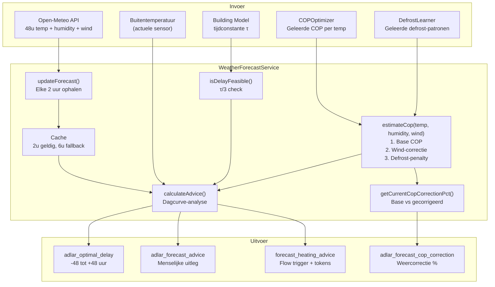
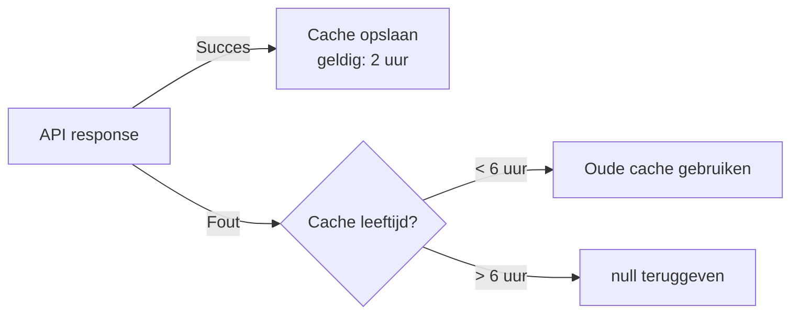
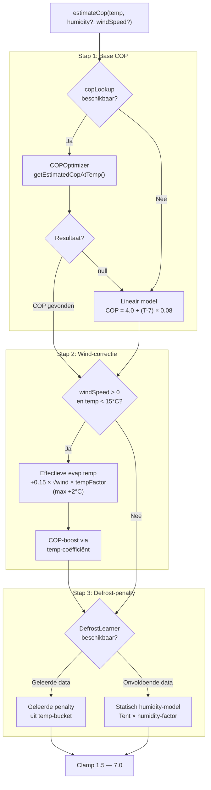
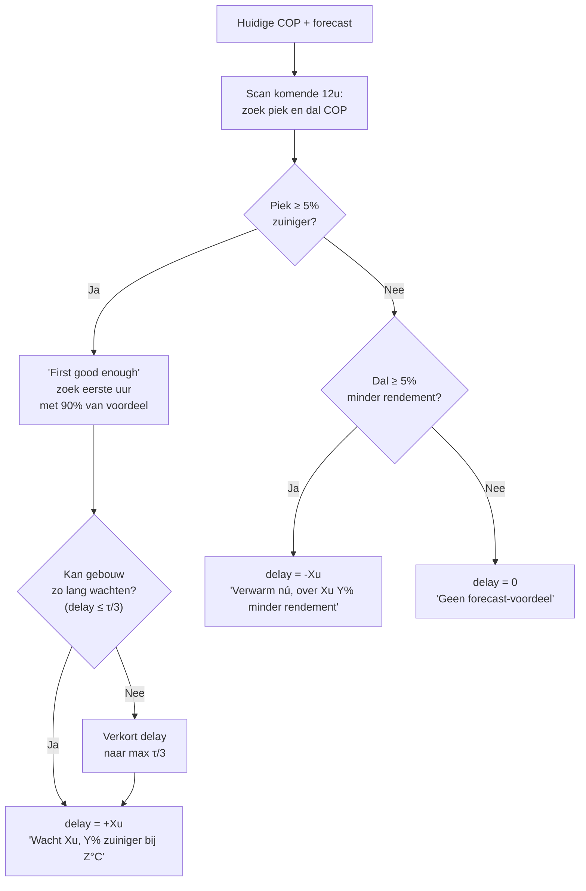

# WeatherForecastService — Functioneel Overzicht v2.9.0

## Architectuur



---

## Dataflow: van API tot advies

### 1. Forecast ophalen

| Stap | Detail |
|------|--------|
| **Bron** | `https://api.open-meteo.com/v1/forecast` |
| **Parameters** | `latitude`, `longitude`, `hourly=temperature_2m,cloud_cover,relative_humidity_2m,wind_speed_10m`, `forecast_hours=48` |
| **Locatie** | Settings `forecast_location_lat/lon` (default: Amsterdam 52.37, 4.90) |
| **Interval** | Elke 2 uur + directe fetch bij start |
| **HTTP client** | Native `fetch()` (Node 22 compatible) |
| **Timeout** | 10 seconden via `AbortController` |

### 2. Cache-strategie



---

## COP-schatting: `estimateCop()`

De COP-schatting gebruikt een **drie-staps correctiepijplijn**:



### Stap 1: Base COP

#### Laag 1: Geleerde COP (COPOptimizer)

De `COPOptimizer.getEstimatedCopAtTemp()` methode gebruikt een drie-lagen lookup:

| Prioriteit | Methode | Wanneer |
|-----------|---------|---------|
| **1** | Exact bucket match | Bucket (2°C) heeft ≥5 samples |
| **2** | Lineaire interpolatie | Twee naburige buckets beschikbaar |
| **3** | Lineaire extrapolatie | Temperatuur buiten bekende range |
| — | `null` (→ fallback) | Minder dan 2 geleerde buckets |

**Voorbeeld interpolatie:**

```text
Geleerde buckets: 4°C → COP 3.6, 8°C → COP 4.1
Vraag: COP bij 6°C?
→ 3.6 + (6-4)/(8-4) × (4.1-3.6) = 3.85
```

#### Laag 2: Lineair model (fallback)

Gebruikt wanneer COPOptimizer onvoldoende data heeft (nieuwe installaties):

| Parameter | Waarde |
|-----------|--------|
| Referentie | COP 4.0 bij 7°C (A7/W35 standaard) |
| Coëfficiënt | +0.08 COP per °C |
| Range | 1.5 — 7.0 (clamped) |

| Buitentemp | Fallback COP |
|-----------|-------------|
| -5°C | 3.04 |
| 0°C | 3.44 |
| 5°C | 3.84 |
| 7°C | 4.00 |
| 10°C | 4.24 |
| 15°C | 4.64 |
| 20°C | 5.04 |

#### Koppeling (device.ts integratie)

```typescript
weatherService.setCopLookup((temp) => copOptimizer.getEstimatedCopAtTemp(temp));
```

### Stap 2: Wind-correctie (evaporator convectie)

Wind verbetert de geforceerde convectie over de verdamper, waardoor de effectieve
luchttemperatuur voor warmteoverdracht stijgt:

| Parameter | Waarde | Bron |
|-----------|--------|------|
| `TEMP_UPPER_LIMIT` | 15°C | Boven 15°C is windeffect verwaarloosbaar |
| `CONVECTION_FACTOR` | 0.15 | Empirische schaalfactor (°C per √(km/h)) |
| `MAX_TEMP_BOOST` | 2.0°C | Maximale effectieve temperatuurwinst |

**Formule:**

```text
tempFactor = min((TEMP_UPPER_LIMIT - outdoorTemp) / 15, 1.0)
effectiveTempBoost = min(CONVECTION_FACTOR × √windSpeed × tempFactor, MAX_TEMP_BOOST)
copBoost = effectiveTempBoost × COP_TEMP_COEFFICIENT (0.08)
```

**Voorbeeld:** bij 2°C en 20 km/h wind:

```text
tempFactor = min((15-2)/15, 1) = 0.87
boost = min(0.15 × √20 × 0.87, 2.0) = min(0.58, 2.0) = 0.58°C
copBoost = 0.58 × 0.08 = +0.046 COP
```

**Onafhankelijk van WindCorrectionService**: Deze correctie betreft
alleen de COP-schatting op de verdamper. De bestaande `WindCorrectionService`
corrigeert gebouwwarmteverlies (wind-chill effect op het gebouw) en blijft
volledig gescheiden.

### Stap 3: Defrost-penalty (lerend model)

Defrost-cycli verlagen de effectieve COP doordat de warmtepomp tijdelijk
stopt met verwarmen en energie verbruikt om ijs van de verdamper te smelten.

#### DefrostLearner — geleerd model

Volgt exact het **COPOptimizer-patroon**:

| Aspect | Detail |
|--------|--------|
| **Data** | Echte defrost-events via DPS 33 (`adlar_state_defrost_state`) |
| **Opslag** | Rolling FIFO history, max 500 events |
| **Buckets** | 2°C temperatuur-buckets (zelfde als COPOptimizer) |
| **Lookup** | 3-laags: exact → interpolatie → extrapolatie |
| **Persistentie** | `setStoreValue('defrost_learning_state')` |
| **Minimum** | 3 events per bucket voor betrouwbare penalty |

**Event-registratie** (device.ts → ServiceCoordinator → AdaptiveControlService):

```text
DPS 33: false → true  →  defrostStartTime opslaan
DPS 33: true → false   →  duur berekenen, recordEvent(temp, durationSec, humidity?)
```

**COP-penalty berekening:**

```text
defrostMinPerHour = (60 / avgIntervalMin) × (avgDurationSec / 60)
copPenaltyFactor = max(1.0 - defrostMinPerHour / 60, 0.80)
```

Voorbeeld: gemiddeld elke 45 min een defrost van 5 min:

```text
defrostMinPerHour = (60/45) × (5/1) = 6.67 min/uur
penalty = max(1 - 6.67/60, 0.80) = max(0.889, 0.80) = 0.889
→ 11.1% COP-reductie
```

#### Statisch fallback-model

Bij onvoldoende geleerde data (<3 events per bucket) wordt een
fysica-gebaseerd model gebruikt:

```text
tempFactor = tent functie gecentreerd op 0°C:
  T < TEMP_LOW (-7°C): 0
  T = 0°C: 1.0 (worst case)
  T > TEMP_HIGH (+7°C): 0

humidityFactor = (humidity - 80) / 20  [lineair 80→0, 100→1]

penalty = 1.0 - (FALLBACK_MAX_PENALTY × tempFactor × humidityFactor)
        = 1.0 - (0.15 × tempFactor × humidityFactor)
```

| Conditie | Temp-factor | Humidity-factor | COP-reductie |
|----------|------------|-----------------|-------------|
| 0°C, 100% RH | 1.0 | 1.0 | -15% |
| 0°C, 90% RH | 1.0 | 0.5 | -7.5% |
| -5°C, 95% RH | 0.29 | 0.75 | -3.2% |
| 5°C, 85% RH | 0.29 | 0.25 | -1.1% |
| 10°C, 90% RH | 0 | 0.5 | 0% |

#### Graceful degradatie

- Geen humidity/wind in API response → correcties neutraal (factor 1.0)
- Geen DefrostLearner → statisch humidity-model
- Geen humidity data → geen defrost-correctie
- Corrupt store state → reset naar leeg (zoals BuildingModelLearner)

---

## Advies-algoritme: `calculateAdvice()`

Analyseert de volledige COP-curve (weergecorrigeerd). Lookahead: 12 uur (instelbaar).



Sinds v2.9.0 vergelijkt `calculateAdvice()` op **weergecorrigeerde COP** in
plaats van alleen temperatuur, waardoor piek/dal-detectie nauwkeuriger is bij
vochtige of winderige omstandigheden.

### Drie scenario's

#### Stijgend (ochtend → middag)

```text
07:00  3°C  COP 3.6  ← Nu
08:00  5°C  COP 3.8
09:00  7°C  COP 4.0  ← "Good enough" (90%)
11:00  9°C  COP 4.1  ← Piek

delay = +2u, advice = "Wacht 2u, 11% zuiniger bij 7°C"
```

#### Dalend (middag → avond)

```text
15:00  10°C  COP 4.2  ← Nu
17:00   5°C  COP 3.8
19:00   1°C  COP 3.5  ← Dal

delay = -4u, advice = "Verwarm nú, over 4u 17% minder rendement"
```

#### Stabiel

```text
delay = 0, advice = "Geen forecast-voordeel"
```

---

## Thermische haalbaarheidscheck

Voorkomt dat het systeem adviseert om langer te wachten dan het gebouw aankan:

| Geleerde τ | Max delay (τ/3) | Voorbeeld |
|-----------|-----------------|-----------|
| 30 uur | 10 uur | Goed geïsoleerd huis |
| 15 uur | 5 uur | Gemiddeld huis |
| 9 uur | 3 uur | Slecht geïsoleerd |
| Onbekend | 12 uur (default) | Building model nog aan het leren |

---

## Capabilities en Flow Card

### adlar_optimal_delay (number, -48 tot +48)

| Waarde | Betekenis | Flow check |
|--------|-----------|-----------|
| `+3.0 u` | Wacht 3 uur | `als delay > 0 → stel uit` |
| `0 u` | Geen voordeel | `als delay = 0 → normaal` |
| `-4.0 u` | Over 4u minder rendement | `als delay < 0 → verwarm nú` |

### adlar_forecast_advice (string)

De menselijke context bij het getal:

- `"Wacht 3u, 8% zuiniger bij 10°C"`
- `"Verwarm nú, over 4u 12% minder rendement"`
- `"Geen forecast-voordeel"`

### adlar_forecast_cop_correction (number, -25 tot +10)

Weercorrectie percentage t.o.v. base COP:

| Waarde | Betekenis |
|--------|-----------|
| `-8.5%` | Defrost + vocht verlagen COP met 8.5% |
| `+1.2%` | Wind-convectie verhoogt effectieve COP |
| `0.0%` | Geen weercorrectie actief |

Berekend via `getCurrentCopCorrectionPct()`: vergelijkt de base COP
(alleen temperatuur) met de volledig gecorrigeerde COP (wind + defrost)
voor het huidige forecast-uur.

### forecast_heating_advice (trigger)

Flow tokens:

| Token | Type | Voorbeeld |
|-------|------|-----------|
| `delay_hours` | number | `3` of `-4` |
| `expected_cop` | number | `4.11` |
| `current_cop` | number | `3.86` |
| `advice_text` | string | `"Wacht 3u, 8% zuiniger bij 10°C"` |

---

## Instellingen

| Setting | Type | Default | Doel |
|---------|------|---------|------|
| `enable_weather_forecast` | checkbox | `false` | Master toggle |
| `forecast_location_lat` | number | `52.37` | Breedtegraad |
| `forecast_location_lon` | number | `4.90` | Lengtegraad |

---

## Configuratie-constanten

### Forecast service

| Constante | Waarde | Betekenis |
|-----------|--------|-----------|
| `CACHE_DURATION_MS` | 2 uur | Normaal cache-interval |
| `MAX_CACHE_AGE_MS` | 6 uur | Maximale fallback-duur |
| `FORECAST_HOURS` | 48 | Uren aan forecastdata |
| `SAVINGS_THRESHOLD_PCT` | 5% | Minimale verbetering voor advies |
| `GOOD_ENOUGH_RATIO` | 90% | "First good enough" drempel |
| `COP_REFERENCE_TEMP` | 7°C | Referentie A7/W35 (fallback) |
| `COP_REFERENCE_VALUE` | 4.0 | COP bij referentietemp (fallback) |
| `COP_TEMP_COEFFICIENT` | 0.08 | COP-verandering per °C (fallback) |

### Defrost-correctie (`FORECAST_DEFROST`)

| Constante | Waarde | Betekenis |
|-----------|--------|-----------|
| `TEMP_LOW` | -7°C | Ondergrens ijsband |
| `TEMP_HIGH` | 7°C | Bovengrens ijsband |
| `HUMIDITY_THRESHOLD` | 80% | Onder dit niveau verwaarloosbaar |
| `FALLBACK_MAX_PENALTY` | 0.15 | 15% max COP-reductie (zonder learned data) |
| `BUCKET_SIZE` | 2°C | Temperatuur-bucket grootte |
| `MIN_EVENTS_PER_BUCKET` | 3 | Minimum events voor betrouwbare lookup |
| `MAX_HISTORY_SIZE` | 500 | Max events in FIFO history |

### Wind-correctie (`FORECAST_WIND_EVAPORATOR`)

| Constante | Waarde | Betekenis |
|-----------|--------|-----------|
| `TEMP_UPPER_LIMIT` | 15°C | Boven geen windcorrectie |
| `CONVECTION_FACTOR` | 0.15 | Empirische schaalfactor |
| `MAX_TEMP_BOOST` | 2.0°C | Max effectieve temp-winst |

---

## Gerelateerde componenten

| Component | Bestand | Relatie |
|-----------|---------|--------|
| COPOptimizer | `lib/adaptive/cop-optimizer.ts` | Levert geleerde COP per temperatuur |
| DefrostLearner | `lib/adaptive/defrost-learner.ts` | Leert defrost-patronen uit DPS 33 events |
| WindCorrectionService | `lib/services/wind-correction-service.ts` | Onafhankelijk — corrigeert gebouwwarmteverlies |
| AdaptiveControlService | `lib/services/adaptive-control-service.ts` | Beheert lifecycle + persistentie |
| ServiceCoordinator | `lib/services/service-coordinator.ts` | Routeert defrost events |
