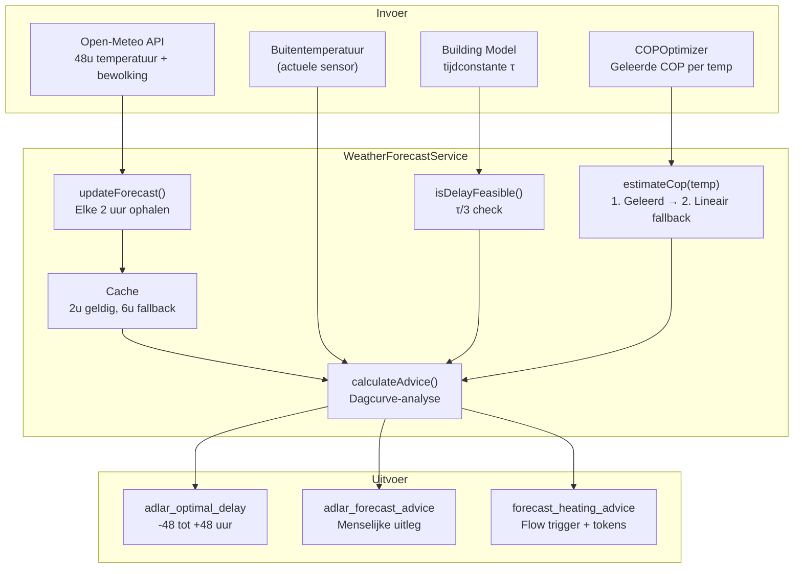
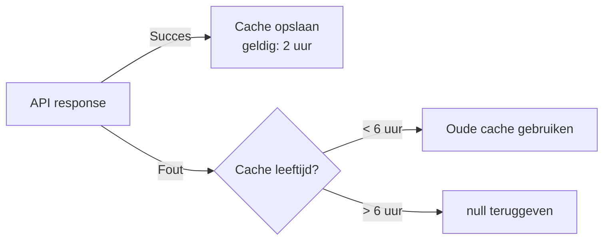
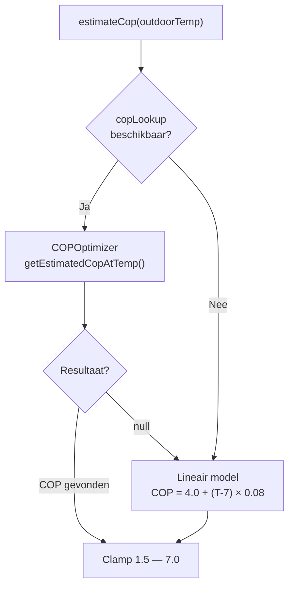
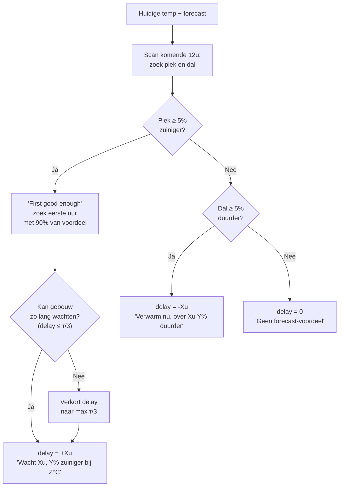

# WeatherForecastService — Functioneel Overzicht v2.8.0

## Architectuur



---

## Dataflow: van API tot advies

### 1. Forecast ophalen

| Stap | Detail |
|------|--------|
| **Bron** | `https://api.open-meteo.com/v1/forecast` |
| **Parameters** | `latitude`, `longitude`, `hourly=temperature_2m,cloud_cover`, `forecast_hours=48` |
| **Locatie** | Settings `forecast_location_lat/lon` (default: Amsterdam 52.37, 4.90) |
| **Interval** | Elke 2 uur + directe fetch bij start |
| **HTTP client** | Native `fetch()` (Node 22 compatible) |
| **Timeout** | 10 seconden via `AbortController` |

### 2. Cache-strategie



---

## COP-schatting: `estimateCop()`

De COP-schatting gebruikt een **twee-lagen strategie** via dependency injection:



### Laag 1: Geleerde COP (COPOptimizer)

De `COPOptimizer.getEstimatedCopAtTemp()` methode gebruikt een drie-lagen lookup:

| Prioriteit | Methode | Wanneer |
|-----------|---------|---------|
| **1** | Exact bucket match | Bucket (2°C) heeft ≥5 samples |
| **2** | Lineaire interpolatie | Twee naburige buckets beschikbaar |
| **3** | Lineaire extrapolatie | Temperatuur buiten bekende range |
| — | `null` (→ fallback) | Minder dan 2 geleerde buckets |

**Voorbeeld interpolatie:**
```
Geleerde buckets: 4°C → COP 3.6, 8°C → COP 4.1
Vraag: COP bij 6°C?
→ 3.6 + (6-4)/(8-4) × (4.1-3.6) = 3.85
```

### Laag 2: Lineair model (fallback)

Gebruikt wanneer COPOptimizer onvoldoende data heeft (nieuwe installaties):

| Parameter | Waarde |
|-----------|--------|
| Referentie | COP 4.0 bij 7°C (A7/W35 standaard) |
| Coëfficiënt | +0.08 COP per °C |
| Range | 1.5 — 7.0 (clamped) |

| Buitentemp | Fallback COP |
|-----------|-------------|
| -5°C | 3.04 |
| 0°C | 3.44 |
| 5°C | 3.84 |
| 7°C | 4.00 |
| 10°C | 4.24 |
| 15°C | 4.64 |
| 20°C | 5.04 |

### Koppeling (device.ts integratie)

```typescript
weatherService.setCopLookup((temp) => copOptimizer.getEstimatedCopAtTemp(temp));
```

---

## Advies-algoritme: `calculateAdvice()`

Analyseert de volledige temperatuurcurve. Lookahead: 12 uur (instelbaar).



### Drie scenario's

#### 🔼 Stijgend (ochtend → middag)

```
07:00  3°C  COP 3.6  ← Nu
08:00  5°C  COP 3.8
09:00  7°C  COP 4.0  ← "Good enough" (90%)
11:00  9°C  COP 4.1  ← Piek

delay = +2u, advice = "Wacht 2u, 11% zuiniger bij 7°C"
```

#### 🔽 Dalend (middag → avond)

```
15:00  10°C  COP 4.2  ← Nu
17:00   5°C  COP 3.8
19:00   1°C  COP 3.5  ← Dal

delay = -4u, advice = "Verwarm nú, over 4u 17% duurder"
```

#### ➡️ Stabiel

```
delay = 0, advice = "Geen forecast-voordeel"
```

---

## Thermische haalbaarheidscheck

Voorkomt dat het systeem adviseert om langer te wachten dan het gebouw aankan:

| Geleerde τ | Max delay (τ/3) | Voorbeeld |
|-----------|-----------------|-----------|
| 30 uur | 10 uur | Goed geïsoleerd huis |
| 15 uur | 5 uur | Gemiddeld huis |
| 9 uur | 3 uur | Slecht geïsoleerd |
| Onbekend | 12 uur (default) | Building model nog aan het leren |

---

## Capabilities en Flow Card

### adlar_optimal_delay (number, -48 tot +48)

| Waarde | Betekenis | Flow check |
|--------|-----------|-----------|
| `+3.0 u` | Wacht 3 uur | `als delay > 0 → stel uit` |
| `0 u` | Geen voordeel | `als delay = 0 → normaal` |
| `-4.0 u` | Over 4u duurder | `als delay < 0 → verwarm nú` |

### adlar_forecast_advice (string)

De menselijke context bij het getal:
- `"Wacht 3u, 8% zuiniger bij 10°C"`
- `"Verwarm nú, over 4u 12% duurder"`
- `"Geen forecast-voordeel"`

### forecast_heating_advice (trigger)

Flow tokens:

| Token | Type | Voorbeeld |
|-------|------|-----------|
| `delay_hours` | number | `3` of `-4` |
| `expected_cop` | number | `4.11` |
| `current_cop` | number | `3.86` |
| `advice_text` | string | `"Wacht 3u, 8% zuiniger bij 10°C"` |

---

## Instellingen

| Setting | Type | Default | Doel |
|---------|------|---------|------|
| `enable_weather_forecast` | checkbox | `false` | Master toggle |
| `forecast_location_lat` | number | `52.37` | Breedtegraad |
| `forecast_location_lon` | number | `4.90` | Lengtegraad |

---

## Configuratie-constanten

| Constante | Waarde | Betekenis |
|-----------|--------|-----------|
| `CACHE_DURATION_MS` | 2 uur | Normaal cache-interval |
| `MAX_CACHE_AGE_MS` | 6 uur | Maximale fallback-duur |
| `FORECAST_HOURS` | 48 | Uren aan forecastdata |
| `SAVINGS_THRESHOLD_PCT` | 5% | Minimale verbetering voor advies |
| `GOOD_ENOUGH_RATIO` | 90% | "First good enough" drempel |
| `COP_REFERENCE_TEMP` | 7°C | Referentie A7/W35 (fallback) |
| `COP_REFERENCE_VALUE` | 4.0 | COP bij referentietemp (fallback) |
| `COP_TEMP_COEFFICIENT` | 0.08 | COP-verandering per °C (fallback) |

---

## Nog te integreren

| Item | Status |
|------|--------|
| Service registreren in `device.ts` | ⬜ |
| Capabilities updaten vanuit service | ⬜ |
| Flow trigger activeren bij nieuw advies | ⬜ |
| `copLookup` koppelen aan COPOptimizer | ⬜ |
| `homey:manager:geolocation` permissie + auto-locatie | ⬜ |
