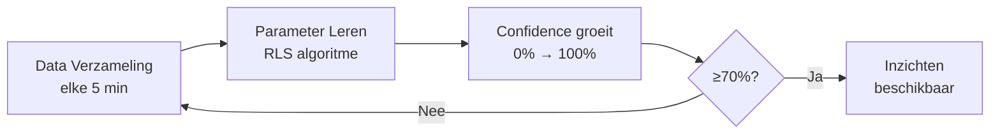

# Gebouwinzichten & Aanbevelingen Gids

**Versie**: 2.6.0+ | **Laatst bijgewerkt**: Januari 2026

---

## Inhoudsopgave

1. [Introductie](#introductie)
2. [Wat zijn Gebouwinzichten?](#wat-zijn-gebouwinzichten)
3. [Hoe het werkt](#hoe-het-werkt)
4. [Inzicht Categorieën](#inzicht-categorieën)
5. [Inzichten begrijpen](#inzichten-begrijpen)
6. [Actie ondernemen](#actie-ondernemen)
7. [Voorbeeldflows](#voorbeeldflows)
8. [Instellingen](#instellingen)
9. [Probleemoplossing](#probleemoplossing)
10. [FAQ](#faq)

---

## Introductie

De **Gebouwinzichten & Aanbevelingen** functie transformeert je warmtepomp van een simpele temperatuurregelaar naar een intelligente energieadviseur. Na 24-48 uur leren van de thermische eigenschappen van je gebouw, geeft het systeem **concrete, bruikbare aanbevelingen** met geschatte besparingen in euro's per maand.

### Belangrijkste Voordelen

| Voordeel | Besparing |
|----------|-----------|
| 💰 Isolatie-inzichten | 10-30% |
| ⏱️ Voorverwarmen optimalisatie | 5-10% |
| 🏠 Thermische opslag strategieën | 10-25% (met dynamische prijzen) |
| 📊 ROI transparantie | Elke aanbeveling incl. maandelijkse besparing |

---

## Wat zijn Gebouwinzichten?

Gebouwinzichten analyseren de **5 thermische parameters** die door het Gebouwmodel worden geleerd:

| Parameter | Symbool | Betekenis | Typisch Bereik |
|-----------|---------|-----------|----------------|
| **Thermische Massa** | C | Warmtecapaciteit - hoeveel energie nodig voor 1°C | 7-30 kWh/°C |
| **Warmteverlies Coëfficiënt** | UA | Snelheid van warmteverlies per graad verschil | 0.05-0.5 kW/°C |
| **Tijdsconstante** | τ (tau) | Hoe snel gebouw opwarmt/afkoelt (τ = C/UA) | 5-25 uur |
| **Zonnewinst Factor** | g | Effectiviteit van zonnestraling opwarming | 0.3-0.6 |
| **Interne Warmtewinst** | P_int | Warmte van mensen, apparaten, koken | 0.2-0.5 kW |

Het systeem vergelijkt geleerde waarden met:
- **Je geselecteerde gebouwprofiel** (Licht/Gemiddeld/Zwaar/Passief)
- **Typische waarden voor goed geïsoleerde gebouwen**
- **Je energieprijsdata** (indien beschikbaar)

Bij optimalisatiekansen genereert het **inzichten** met specifieke aanbevelingen.

---

## Hoe het werkt

### Leerfase (24-48 uur)



**Data die verzameld wordt:**
- Binnentemperatuur (externe sensor)
- Buitentemperatuur (warmtepomp of externe sensor)
- Elektrisch vermogen
- Geschatte zonnestraling

**Inzichten generatie:**
- Systeem evalueert elke 50 minuten (10 samples)
- Detecteert patronen: slechte isolatie, thermische opslag potentieel, voorverwarmen kansen
- Genereert aanbevelingen met ROI schattingen

### Continue Monitoring

- **Past aan bij seizoenen** (zonnewinst multipliers, interne warmte patronen)
- **Update inzichten** bij parameter drift >10%
- **Rate limited** om "advies-moeheid" te voorkomen (max 1 inzicht per categorie per dag)

---

## Inzicht Categorieën

Het systeem biedt **3 prioriteit categorieën** + 1 diagnostische:

### 1. 🏠 Isolatie Prestatie Inzichten

**Wat het detecteert:**
- Hoog warmteverlies (UA > verwacht)
- Uitstekende isolatie (UA < verwacht)

**Voorbeeld Inzicht:**
> "🏠 Hoog warmteverlies - UA 0.52 kW/°C (verwacht: 0.30)"

**Voorbeeld Aanbeveling:**
> "Overweeg isolatie upgrades: dak (25% besparing), muren (15%), ramen (10%). Geschatte besparing: €120/maand"

**Wanneer het triggert:**
- Confidence ≥ 70%
- UA > 1.5× profiel UA **OF** UA > 0.5 kW/°C (absolute drempel)

**Wat te doen:**
1. **Verificeer de meting** - Check of deuren/ramen open stonden tijdens leren
2. **Prioriteer upgrades** - Dakisolatie geeft hoogste ROI (25% van totale besparing)
3. **Vraag offertes** - Gebruik €120/maand schatting om terugverdientijd te berekenen
4. **Implementeer nachtverlaging** - Reduceer warmteverlies tijdens onbewoonde uren

---

### 2. ⏱️ Voorverwarmen Strategie Inzichten

**Wat het detecteert:**
- Snelle thermische respons (τ < 5 uur)
- Medium thermische respons (τ 5-15 uur)
- Trage thermische respons (τ > 15 uur)

**Voorbeeld Inzicht:**
> "⏱️ Snelle thermische respons - gebouw warmt op in 4.2 uur"

**Voorbeeld Aanbeveling:**
> "Schakel agressieve nachtverlaging naar 16°C in, voorverwarmen 2 uur voor wakker worden (05:00 → 07:00 klaar). Geschat 12% energiebesparing."

**Aanbevolen acties per type:**

| Respons Type | τ | Nachtverlaging | Voorverwarmen | Besparing |
|--------------|---|----------------|---------------|-----------|
| Snel | <5u | Agressief (16-17°C) | 2-3 uur | 10-15% |
| Medium | 5-15u | Matig (17-18°C) | 4-5 uur | 6-10% |
| Traag | >15u | Minimaal of geen | Niet praktisch | 3-5% |

---

### 3. 💰 Thermische Opslag Optimalisatie Inzichten

**Wat het detecteert:**
- Hoge thermische massa gebouwen (C > 18 kWh/°C) met trage respons (τ > 12u)
- Mogelijkheid om energie op te slaan tijdens goedkope uren, coasten tijdens dure uren

**Voorbeeld Inzicht (met dynamische prijzen):**
> "💰 Thermische opslag potentieel - C=24 kWh/°C, τ=18u"

**Voorbeeld Aanbeveling:**
> "Voorverwarmen +2°C tijdens goedkope uren (02:00-06:00), coasten -1°C tijdens piek (17:00-21:00). Geschatte besparing: €95/maand"

**Voorbeeld Inzicht (zonder dynamische prijzen):**
> "💡 Gebouw geschikt voor thermische opslag - C=24 kWh/°C, τ=18u"

**Voorbeeld Aanbeveling:**
> "Voeg dynamische energieprijzen toe via flow kaart 'Ontvang externe energieprijzen' om kostenoptimalisatie in te schakelen. Potentiële besparing: 15-25%"

**Thermische Opslag Berekening:**
```
Opgeslagen energie = C × Temp verschuiving = 24 kWh/°C × 2°C = 48 kWh
Dagelijkse besparing = Opgeslagen energie × Prijsverschil × Benuttingsfactor
                     = 48 kWh × €0.15/kWh × 0.70 = €5.04/dag
Maandelijkse besparing = €5.04 × 30 = €151/maand
```

---

### 4. 🔄 Gebouwprofiel Mismatch (Diagnostisch)

**Wat het detecteert:**
- Geselecteerd gebouwprofiel komt niet overeen met geleerd gedrag
- >30% afwijking in tijdsconstante (τ)

**Voorbeeld Inzicht:**
> "🔄 Gebouw gedraagt zich als 'zwaar' (τ=18u vs 'gemiddeld' τ=10u)"

**Voorbeeld Aanbeveling:**
> "Wijzig gebouwprofiel naar 'zwaar' in apparaatinstellingen voor sneller leren en betere initiële parameters"

**Profiel Kenmerken:**

| Profiel | C (kWh/°C) | UA (kW/°C) | τ (uur) | Gebouwtype |
|---------|-----------|-----------|---------|------------|
| **Licht** | 7 | 0.35 | 20 | Houtskelet, basis isolatie, snelle temp wisselingen |
| **Gemiddeld** | 15 | 0.30 | 50 | Baksteen, spouwmuur, dubbel glas (typisch NL) |
| **Zwaar** | 20 | 0.25 | 80 | Beton/steen, goede isolatie, HR++ glas |
| **Passief** | 30 | 0.05 | 600 | Passiefhuis, HR+++, luchtdicht, WTW |

---

## Inzichten begrijpen

### Waar te vinden

**Apparaat Capabilities** (zichtbaar in Homey app):
1. **Primair Gebouwinzicht** — Belangrijkste inzicht (hoogste prioriteit)
2. **Secundair Gebouwinzicht** — Tweede-hoogste prioriteit
3. **Aanbevolen Actie** — Specifieke actie om te ondernemen
4. **Gebouwinzichten Diagnostiek (JSON)** — Gedetailleerde technische data

**Flow Trigger Kaarten:**
1. **"Nieuw gebouwinzicht gedetecteerd"** — Triggert bij nieuwe inzichten
2. **"Voorverwarmen tijd aanbeveling"** — Dagelijkse trigger om 23:00
3. **"Gebouwprofiel mismatch gedetecteerd"** — Eenmalige trigger

### Inzicht Levenscyclus

| Status | Icoon | Beschrijving |
|--------|-------|--------------|
| Nieuw | 🆕 | Net gedetecteerd, notificatie verzonden |
| Actief | ✅ | Weergegeven in capabilities |
| Bevestigd | 👀 | Gebruiker heeft gezien |
| Afgewezen | 🚫 | Verborgen voor 30 dagen |
| Opgelost | ✔️ | Actie geïmplementeerd |

### Prioriteit Systeem

Inzichten worden gerangschikt 0-100 op basis van:
- **Confidence** (30%) — Model zekerheid
- **Energiebesparing potentieel** (40%) — €/maand schatting
- **Actie eenvoud** (20%) — Hoe makkelijk te implementeren
- **Directe impact** (10%) — Snel vs. lange termijn voordeel

**Weergave regel:** Max 3 actieve inzichten tegelijk (hoogste prioriteit eerst)

---

## Actie ondernemen

### Stap-voor-stap Actie Gids

#### Voor Isolatie Inzichten:

| Termijn | Acties |
|---------|--------|
| **Direct** (0-1 week) | ✅ Nachtverlaging inschakelen<br/>✅ Luchtlekken checken en afdichten |
| **Korte termijn** (1-3 maanden) | ✅ Offertes voor dakisolatie (€3000-6000, terugverdientijd 2-4 jaar)<br/>✅ Spouwmuurisolatie overwegen (€1500-3000)<br/>✅ Ramen evalueren voor HR++ glas |
| **Lange termijn** (6-12 maanden) | ✅ Uitgebreid isolatiepakket plannen<br/>✅ Subsidies checken (ISDE, gemeentelijke regelingen)<br/>✅ Totale ROI berekenen met maandelijkse besparing |

#### Voor Voorverwarmen Inzichten:

| Termijn | Acties |
|---------|--------|
| **Direct** | ✅ Automatisering flow maken met `pre_heat_recommendation` trigger<br/>✅ Nachtverlaging testen (start conservatief: 2°C reductie) |
| **Optimalisatie** | ✅ Verlaging verfijnen op basis van comfort<br/>✅ Wektijd instelling aanpassen indien nodig |

#### Voor Thermische Opslag Inzichten:

| Termijn | Acties |
|---------|--------|
| **Voorwaarden** (1-2 weken) | ✅ Aanmelden voor dynamisch energiecontract<br/>✅ Energy Prices app installeren<br/>✅ Flow opzetten om prijzen door te sturen |
| **Implementatie** | ✅ Thermische opslag automatisering maken<br/>✅ Conservatief starten (±1°C aanpassingen) |
| **Optimalisatie** | ✅ Temperatuurverschuiving verhogen indien comfortabel<br/>✅ Timing aanpassen op jouw prijscurve |

---

## Voorbeeldflows

### Flow 1: Automatisch Voorverwarmen Schema

```
WHEN Voorverwarmen tijd aanbeveling
  (triggert dagelijks om 23:00 met optimale starttijd)

THEN
  1. Zet doeltemperatuur op 17°C om 22:00
     (nachtverlaging - gebouw koelt langzaam)

  2. Zet doeltemperatuur op 21°C op {{start_time}} token
     (voorverwarmen begint - berekend op basis van τ)

  3. Notificatie: "Voorverwarmen gepland voor {{start_time}} ({{duration_hours}}u)"
```

---

### Flow 2: Thermische Opslag met Dynamische Prijzen

```
WHEN Goedkoopste energieblok gestart
  (van Energy Prices app - typisch 02:00-06:00)

AND Gebouwinzicht gedetecteerd, categorie = "thermal_storage"

THEN
  1. Verhoog doeltemperatuur met 2°C (sla thermische energie op)
  2. Notificatie: "Thermische opslag: voorverwarmen naar {{target}}°C"
```

```
WHEN Duurste energieblok gestart
  (typisch 17:00-21:00)

THEN
  1. Verlaag doeltemperatuur met 1°C (coast op opgeslagen energie)
  2. Notificatie: "Thermische opslag: coasten op {{target}}°C"
```

---

### Flow 3: Hoge-Prioriteit Inzicht Notificaties

```
WHEN Nieuw gebouwinzicht gedetecteerd

AND {{estimated_savings_eur_month}} is groter dan 70
AND {{priority}} is groter dan 70

THEN
  Stuur notificatie:
    "💰 Energiebesparing Kans!"
    "{{insight}}"
    "Actie: {{recommendation}}"
    "Potentieel: €{{estimated_savings_eur_month}}/maand"
```

---

### Flow 4: Profiel Mismatch Auto-Correctie

```
WHEN Gebouwprofiel mismatch gedetecteerd

AND {{deviation_percent}} is groter dan 40

THEN
  1. Wijzig apparaatinstelling "building_profile" naar {{suggested_profile}}
  2. Notificatie:
     "Gebouwprofiel bijgewerkt van {{current_profile}} naar {{suggested_profile}}"
```

---

## Instellingen

### Inzichten Instellingen

**Locatie:** Apparaatinstellingen → Gebouwinzichten & Aanbevelingen

| Instelling | Standaard | Bereik | Beschrijving |
|------------|-----------|--------|--------------|
| **Gebouwinzichten inschakelen** | AAN | AAN/UIT | Hoofdschakelaar |
| **Minimum Confidence (%)** | 70% | 50-90% | Drempel voor tonen inzichten |
| **Max Actieve Inzichten** | 3 | 1-5 | Maximum simultane inzichten |
| **Wektijd** | 07:00 | UU:MM | Doeltijd voor voorverwarmen voltooiing |
| **Nachtverlaging (°C)** | 4.0 | 2.0-6.0 | Temperatuurreductie 's nachts |

### Aanbevolen Instellingen per Gebruikerstype

| Type | Confidence | Max Inzichten | Nachtverlaging |
|------|------------|---------------|----------------|
| **Beginner** (eerste 2 weken) | 70% | 2 | 2°C |
| **Gemiddeld** (na 1 maand) | 65% | 3 | 4°C |
| **Gevorderd** (na 3 maanden) | 60% | 5 | Op basis van τ |

---

## Probleemoplossing

### Geen Inzichten na 48 Uur

| Oorzaak | Oplossing |
|---------|-----------|
| Model confidence <70% | Wacht langer (tot 72 uur) of verlaag drempel naar 65% |
| Inzichten uitgeschakeld | Check Apparaatinstellingen → Gebouwinzichten inschakelen |
| Gebouw presteert exact zoals verwacht | Goed nieuws! Geen optimalisatie nodig |
| Ontbrekende databronnen | Zorg dat externe binnentemp sensor verbonden is |

### Inzichten Tonen Verkeerde Besparing Schattingen

| Oorzaak | Impact | Oplossing |
|---------|--------|-----------|
| Energieprijs ≠ €0.30/kWh | Schattingen proportioneel | Vermenigvuldig met (jouw prijs / 0.30) |
| COP ≠ 3.5 | Hogere COP = hogere besparing | Schattingen zijn conservatief |
| Stookuren ≠ 4000u/jaar | Meer uren = hogere besparing | Monitor werkelijke besparing na 1 maand |

### Voorverwarmen Aanbeveling Triggert Niet

| Oorzaak | Oplossing |
|---------|-----------|
| Model confidence <70% | Wacht op leren |
| Wektijd niet geconfigureerd | Stel in via Apparaatinstellingen |
| Flow kaart niet gemaakt | Maak flow met "Voorverwarmen tijd aanbeveling" trigger |

---

## FAQ

### V: Hoe lang duurt het leren?

**A:** 24-48 uur voor 70% confidence (standaard drempel). Je kunt verlagen naar 50% voor eerdere inzichten (minder accuraat). Volledige convergentie duurt 1-3 weken.

### V: Worden inzichten bijgewerkt als ik isolatie verbeter?

**A:** Ja! Het model leert continu. Na isolatie upgrades zou UA moeten dalen over 3-7 dagen. Het "slechte isolatie" inzicht verdwijnt en kan vervangen worden door "uitstekende isolatie" of "thermische opslag kans".

### V: Wat als mijn gebouw in geen enkel profiel past?

**A:** Profielen zijn alleen startpunten om leren te versnellen. Na 48 uur overschrijven de geleerde parameters het profiel volledig.

### V: Waarom lijkt mijn τ (tijdsconstante) hoog/laag?

**A:** τ hangt af van zowel thermische massa (C) als warmteverlies (UA):
- **Hoge τ** (>15u): Zwaar gebouw (hoge C) OF uitstekende isolatie (lage UA)
- **Lage τ** (<5u): Licht gebouw (lage C) OF slechte isolatie (hoge UA)

### V: Hoe accuraat zijn de besparingschattingen?

**A:** Doelnauwkeurigheid is ±20%. Ze zijn gebaseerd op conservatieve aannames (COP 3.5, 4000 stookuren, €0.30/kWh). Monitor werkelijke besparing via Homey Energy na implementatie.

### V: Wat gebeurt er als ik apparaatinstellingen wijzig tijdens leren?

**A:** Minimale impact. Het model leert gebouwkenmerken, niet warmtepomp instellingen. Maar vermijd:
- Gebouwprofiel wijzigen tijdens leren (reset parameters)
- Gebouwmodel resetten (verliest alle geleerde data)
- Frequente modus wisselingen (verwarring voor model)

---

## Support & Feedback

**Bug gevonden?** [Meld op GitHub Issues](https://github.com/hermanhilberink/org.hhi.adlar-heatpump/issues)

**Feature verzoek?** Voeg toe aan [GitHub Discussions](https://github.com/hermanhilberink/org.hhi.adlar-heatpump/discussions)

**Hulp nodig?** Vraag in [Homey Community Forum](https://community.homey.app)

---

*Veel succes met optimaliseren! 🎉*
