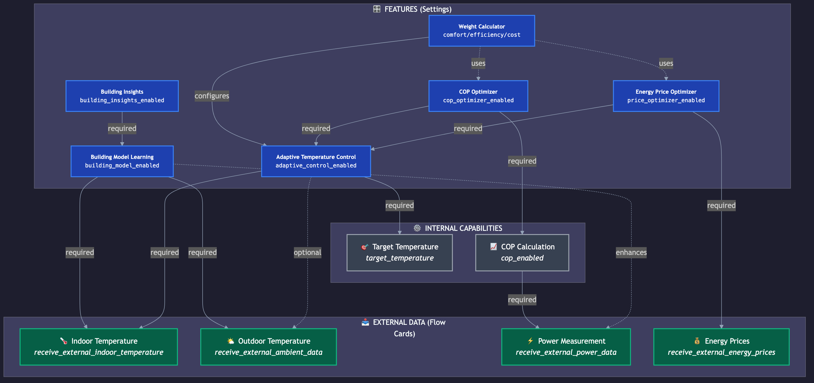

# Adlar Heat Pump App - Advanced Features Introduction

This guide shows you how to activate the advanced features of the Adlar Heat Pump app by connecting external data, and demonstrates the powerful calculator flow cards.

---

## Part 1: Connecting External Data (Setup)

To unlock the full functionality of the app, you can connect external sensors and data via Homey flows. This unlocks features such as COP calculation, adaptive temperature control, and price optimization.

### 1.1 Connecting External Power (for COP Calculation)

Connect an external power meter (e.g., from your electrical panel) for accurate COP calculation.


**How to set up:**
```
WHEN: [Heat pump kWh meter] Power has changed
THEN: [Intelligent Heat Pump] Send {{Power}} W to heat pump for COP calculation
```

**What this unlocks:**
- ✅ Accurate real-time COP calculation (±5% accuracy)
- ✅ Daily and monthly COP trending
- ✅ COP flow card triggers and conditions
- ✅ COP Optimization feature

> [!NOTE]
> **What if you don't have power measurement?**
> 
> If you **don't** have an external power meter and your heat pump **doesn't** have internal power measurement (no DPS for voltage/current/power), then the following features are **not available**:
>
> | ❌ Not Available | ✅ Still Works |
> |------------------|----------------|
> | Real-time COP calculation | Adaptive temperature control |
> | Daily/Monthly COP | Building model learning |
> | COP Optimization | Building Insights (without € savings) |
> | COP Flow Cards | Weather compensation heating curve |
> | Energy Dashboard integration | Status/Mode monitoring |
> | Energy cost calculation | Price optimization (theoretical) |
>
> **Solutions:**
> - **Smart plug with power measurement** (Shelly PM, FIBARO) - Note: must handle 2000-4000W
> - **Separate kWh meter in electrical panel** (Qubino, Eastron SDM) - More accurate, requires installation
> - **P1 meter subgroup** - If your P1 app can distinguish groups

---

### 1.2 Connecting External Indoor Temperature (for Adaptive Control)

Connect a room thermostat or temperature sensor for adaptive temperature control.


**How to set up:**
```
WHEN: [Living room sensor] Temperature has changed
THEN: [Intelligent Heat Pump] Send {{Temperature}} °C indoor temperature for adaptive control
```

**What this unlocks:**
- ✅ Adaptive temperature control (PI controller)
- ✅ Stable indoor temperature (±0.3°C)
- ✅ Building model learning (thermal mass, insulation)
- ✅ Building Insights with savings recommendations

---

### 1.3 Connecting External Outdoor Temperature (for Thermal Model)

Connect a weather station or weather service data for better thermal predictions.


**How to set up:**
```
WHEN: [Weather service] Current temp has changed
THEN: [Intelligent Heat Pump] Send {{Current temperature}} °C to heat pump for COP/thermal mass calculation
```

**What this unlocks:**
- ✅ Improved COP calculation (Carnot reference)
- ✅ More accurate building model learning
- ✅ Weather compensation for heating curve
- ✅ Seasonal optimizations

> [!NOTE]
> **Does it work without external outdoor temperature?**
> 
> Yes! The app automatically uses the **internal ambient sensor (DPS 25)** of the heat pump as fallback. All features work with this sensor, but with lower accuracy.
>
> | Source | Accuracy | Note |
> |--------|----------|------|
> | **External sensor** (weather service, weather station) | ±0.5°C | Recommended for best results |
> | **Internal sensor** (DPS 25) | ±2-3°C | Affected by waste heat from outdoor unit |
>
> **Impact on features:**
> - Building model: τ (time constant) may deviate ~10%
> - COP Carnot reference: ~5% less accurate
> - Predictions: Slightly less accurate planning
>
> **Conclusion:** External connection is *optional* for better accuracy, not required.

---

### 1.4 Connecting External Energy Prices (for Price Optimization)

Connect a dynamic energy price app (e.g., PBTH or EnergyZero) for smart price optimization.


**How to set up:**
```
WHEN: [Energy price app] New prices received for upcoming hours
THEN: [Intelligent Heat Pump] Send external energy prices {{Prices}} for price optimization
```

**What this unlocks:**
- ✅ Automatic price optimization
- ✅ Pre-heating during cheap hours
- ✅ Avoiding peak prices
- ✅ Estimated savings: €400-600/year

---

### 1.5 Connect External Solar Radiation (for Building Model Solar Gain)

Connect a solar radiation sensor (e.g., KNMI) for accurate solar gain calculation in the building model.


**How to set up:**
```
WHEN: [KNMI] Radiation intensity changed
THEN: [Intelligent Heat Pump] Send solar radiation {{Radiation intensity}} W/m² to heat pump
```

**What this unlocks:**

- ✅ Accurate g-factor (solar gain coefficient) in building model
- ✅ Better heating demand prediction on sunny days
- ✅ Optimal passive solar gain utilization
- ✅ Reduced heating demand during high irradiation

> [!NOTE]
> **Benefit of external solar radiation sensor:**
>
> Without an external sensor, the app can only infer solar gain indirectly from temperature increases. With direct radiation measurement, the **g-factor is 30-40% more accurate**.
>
> | Source | g-factor accuracy | Remark |
> |--------|-------------------|--------|
> | **With radiation sensor** | ±15% | Direct irradiation measurement |
> | **Without sensor** | ±40-50% | Derived from temp deltas |
>
> **Impact:**
>
> - Building model: g-factor represents actual glass surface and orientation
> - Predictions: Better anticipation of sunny periods
> - Energy savings: Up to 5-10% heating demand reduction on sunny days
>
> **Conclusion:** External connection is *optional* but provides significantly better solar gain modeling.

---

### 1.6 Connect External Wind Speed (for Building Model Wind Correction)

Connect a wind speed sensor (e.g., KNMI) for accurate calculation of wind-related heat loss.


**How to set up:**
```
WHEN: [KNMI] Wind speed changed
THEN: [Intelligent Heat Pump] Send wind speed {{Wind speed}} km/h to heat pump
```

**What this unlocks:**

- ✅ W_corr parameter in building model (wind correction factor)
- ✅ Dynamic UA correction during strong wind (+20-50% additional heat loss)
- ✅ Better heating demand prediction during storms
- ✅ More accurate τ (time constant) calculation

> [!NOTE]
> **Impact of wind on heat loss:**
>
> Wind increases heat loss through **convective cooling** of facades. During storms (>50 km/h), heat loss can be **20-50% higher** than in calm conditions.
>
> | Wind speed | Extra heat loss | W_corr typical |
> |------------|-----------------|---------------:|
> | 0-10 km/h | Negligible | 0.00-0.03 |
> | 10-30 km/h | +5-15% | 0.03-0.07 |
> | 30-50 km/h | +15-30% | 0.07-0.10 |
> | >50 km/h | +30-50% | 0.10-0.12 |
>
> **Functions without wind correction:**
>
> - Building model still works, but UA value is an average without wind correction
> - During storms, prediction can deviate by 10-20%
>
> **Conclusion:** External connection is *optional* but provides significantly better predictions with variable wind.

---

### 1.7 Connect External Solar Panel Power (for Solar Radiation Calculation)

Connect your solar inverter (e.g., SolarEdge, Enphase) for accurate solar radiation calculation based on current PV power.


**How to set up:**
```
WHEN: [SolarEdge] Power changed
THEN: [Intelligent Heat Pump] Send solar panel power {{Power}}W to heat pump
```

**What this unlocks:**

- ✅ Calculate solar radiation from PV power and panel specifications
- ✅ Alternative to direct radiation sensor (if not available)
- ✅ Accurate g-factor determination in building model
- ✅ Optimal solar gain modeling

> [!NOTE]
> **Deriving solar radiation from PV power:**
>
> The app can **calculate** solar radiation from your solar panels' current power:
>
> **Formula:** `Radiation (W/m²) = PV power (W) / (Panel area (m²) × Efficiency (%))`
>
> **Example:**
>
> - 10 panels of 1.7m² with 20% efficiency = 3.4 m² effective area
> - At 2000W PV power → Radiation = 2000 / 3.4 = ~588 W/m²
>
> **Advantages vs. direct radiation sensor:**
>
> - ✅ No additional sensor needed (uses existing PV monitoring)
> - ✅ Represents actual radiation at your location and orientation
> - ⚠️ However less accurate with dirty panels or shade
>
> **Choice between PV power and radiation sensor:**
>
> | Situation | Best choice |
> |-----------|-------------|
> | Solar panels available | PV power (pragmatic) |
> | No solar panels | KNMI radiation sensor |
> | Optimal accuracy | Connect both (app uses best source) |
>
> **Conclusion:** PV power is a *smart alternative source* for solar radiation data.

---

### 1.8 Overview: Features and Dependencies

The diagram below shows the relationship between advanced features and their required data sources.



**Legend:**
| Color | Meaning |
|-------|---------|
| 🔵 **Blue** | Features (activatable via settings) |
| 🟢 **Green** | External data sources (via Flow Cards) |
| ⚫ **Gray** | Internal capabilities |

**Arrows:**
- **Solid line** → Required dependency
- **Dashed line** → Optional/enhancing dependency

**Key takeaways:**
1. **Adaptive Temperature Control** is the core - requires indoor temperature and target temperature
2. **Energy Price Optimizer** and **COP Optimizer** build on Adaptive Control
3. **Building Model Learning** needs indoor temperature + outdoor temperature
4. **Building Insights** requires a working Building Model first
5. **Weight Calculator** combines all three optimizers for decisions

---

## Part 2: Advanced Flow Card Functions (Demo Examples)

After connecting external data, you can use powerful calculator flow cards.

### 2.1 Curve Calculator - Weather Compensation

Automatically calculate the optimal supply temperature based on outdoor temperature using a heating curve.


**How it works:**
```
WHEN: [Aqara] Temperature has changed
THEN: [Intelligent Heat Pump] Calculate value for {{Temperature}} 
     with curve: -10:35, -5:30, 0:27, 5:26, 10:25, 15:24, 20:22..., default: 35
THEN: [Timeline] Create notification with Heating value: {{Calculated Value}} 
     for outdoor temp: {{Temperature}}
```

**Curve definition explained:**
| Outdoor Temp | Supply Temp |
|--------------|-------------|
| -10°C | 35°C |
| -5°C | 30°C |
| 0°C | 27°C |
| +10°C | 25°C |
| +20°C | 22°C |

**Applications:**
- 🌡️ Weather compensation heating curve (L28/L29 parameters)
- 🏠 Energy savings through lower supply temperatures in mild weather
- ⚡ Interpolation between points for smooth transitions

---

### 2.2 Custom Heating Curve - Linear Calculation

Calculate a heating curve with a mathematical formula (y = ax + b), perfect for Adlar L28/L29 parameters.


**How it works:**
```
WHEN: Current temp has changed
THEN: [Intelligent Heat Pump] Calculate heating curve: L29=55°C at -15°C, L28=-5/10°C with outdoor temp
THEN: [Timeline] Create notification with custom heating curve:
     {{Room temperature}} with formula: {{Heating Curve Formula}} 
     from {{Old value}} to {{New value}}
```

**Formula explanation:**
- **L29**: Reference temperature (55°C at -15°C outdoor temp)
- **L28**: Slope (-5°C per 10°C temperature difference)
- **Result**: `y = -0.5x + 47.5` → at 0°C outdoor = 47.5°C supply

**Applications:**
- 📐 Exact replication of Adlar heating curve parameters
- 🔧 Real-time adjustment via flows
- 📊 Formula logging for analysis

---

### 2.3 Time Slots with Variables - Day Programming

Calculate values from time periods with support for dynamic variables.


**How it works:**
```
WHEN: Every 5 minutes
THEN: [Intelligent Heat Pump] Calculate value from time periods:
     00:00-20:00: {{Energy_price}} +1}}
     20:00-23:59: {{Automation_number}} +1}}
THEN: [Timeline] Create notification with Value at {{Time}} is: {{Result value}}
```

**Example results (from the image):**
| Time | Result | Source |
|------|--------|--------|
| 20:01 | 1.2445 | Energy_price + 1 |
| 20:05 | 1.256 | Energy_price + 1 |
| 19:58 | 1.256 | Automation_number + 1 |

**Applications:**
- ⏰ Day/night temperature programming
- 💰 Dynamic price calculations per time slot
- 🏠 Comfort vs. savings programs
- 📅 Weekend vs. weekday schedules

---

## Summary: What Unlocks What?

| External Data | Unlocked Features |
|---------------|-------------------|
| **Power** (kWh meter) | COP calculation, efficiency trends, COP optimization |
| **Indoor Temperature** (sensor) | Adaptive control, building model, building insights |
| **Outdoor Temperature** (weather) | Thermal model, weather compensation, seasonal adjustment |
| **Energy Prices** (dynamic) | Price optimization, pre-heating, cost savings |

---

## Next Steps

1. **Start with COP**: Connect the power meter first for immediate insights
2. **Activate Adaptive Control**: Connect indoor temperature sensor
3. **Add Weather Data**: For better predictions
4. **Enable Price Optimization**: Maximum savings with dynamic rates

---

*See also:*
- [Configuration Guide](../advanced-settings/CONFIGURATION_GUIDE.en.md) - All settings explained
- [Flow Cards Guide](../guide/FLOW_CARDS_GUIDE.en.md) - Complete flow card documentation
- [Adaptive Control Guide](../guide/ADAPTIVE_CONTROL_GUIDE.en.md) - In-depth adaptive control explanation

---

*Last updated: 2026-01-16*
*Version: 2.5.9*
