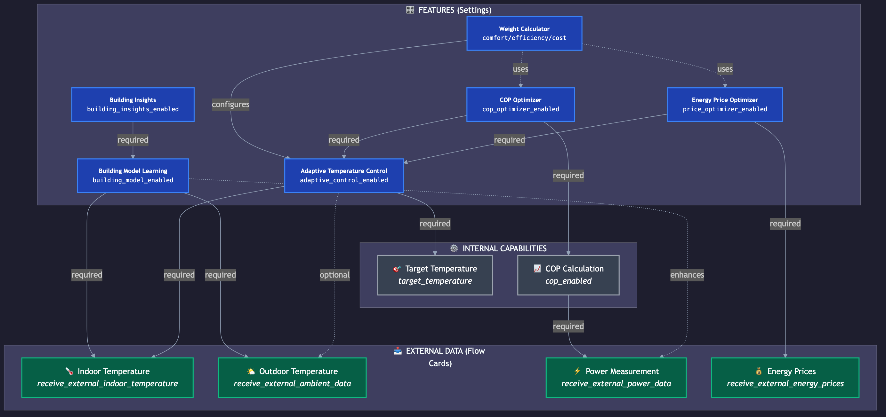

# Adlar Warmtepomp App - Introductie Geavanceerde Functies

Deze handleiding laat zien hoe je de geavanceerde functies van de Adlar Warmtepomp app kunt activeren door externe data te koppelen, en demonstreert de krachtige calculator flow cards.

De externe data is te verkrijgen door het opzetten van externe APPs die de benodigde data bijhouden. 
Onderstaande een opzet van de devices die hier in de subparagrafen gebruikt worden.


---

## Deel 1: Externe Data Koppelen (Setup)

Om de volledige functionaliteit van de app te benutten, kun je externe sensoren en data koppelen via Homey flows. Dit ontsluit functies zoals COP-berekening, adaptieve temperatuurregeling en prijsoptimalisatie.

### 1.1 Extern Vermogen Koppelen (voor COP-berekening)

Koppel een externe vermogensmeter (bijv. van je meterkast) voor nauwkeurige COP-berekening.


**Hoe in te stellen:**
```
WANNEER: [Warmtepomp kWh-meter] Het vermogen is veranderd
DAN: [Intelligent Heat Pump] Stuur {{Vermogen}} W naar warmtepomp voor COP berekening
```

**Wat dit ontsluit:**
- ✅ Nauwkeurige real-time COP berekening (±5% nauwkeurig)
- ✅ Dagelijkse en maandelijkse COP trending
- ✅ COP flow card triggers en conditions
- ✅ COP Optimalisatie functie

> [!NOTE]
> **Wat als je geen vermogensmeting hebt?**
> 
> Als je **geen** externe vermogensmeter hebt én je warmtepomp **geen** interne vermogensmeting heeft (geen DPS voor voltage/current/power), dan zijn de volgende functies **niet beschikbaar**:
>
> | ❌ Niet Beschikbaar | ✅ Werkt Nog Wel |
> |---------------------|-----------------|
> | Real-time COP berekening | Adaptieve temperatuurregeling |
> | Dagelijkse/Maandelijkse COP | Gebouwmodel leren |
> | COP Optimalisatie | Building Insights (zonder €-besparingen) |
> | COP Flow Cards | Weercompensatie stooklijn |
> | Energy Dashboard integratie | Status/Mode monitoring |
> | Energiekosten berekening | Prijsoptimalisatie (theoretisch) |
>
> **Oplossingen:**
> - **Slimme stekker met vermogensmeting** (Shelly PM, FIBARO) - Let op: moet 2000-4000W aankunnen
> - **Aparte kWh-meter in meterkast** (Qubino, Eastron SDM) - Nauwkeuriger, vereist installatie
> - **P1-meter subgroep** - Indien je P1-app groepen kan onderscheiden

---

### 1.2 Externe Binnentemperatuur Koppelen (voor Adaptieve Regeling)

Koppel een kamerthermostaat of temperatuursensor voor adaptieve temperatuurregeling.


**Hoe in te stellen:**
```
WANNEER: [Woonkamer sensor] De temperatuur is veranderd
DAN: [Intelligent Heat Pump] Stuur {{Temperatuur}} °C binnentemperatuur voor adaptieve regeling
```

**Wat dit ontsluit:**
- ✅ Adaptieve temperatuurregeling (PI-controller)
- ✅ Stabiele binnentemperatuur (±0.3°C)
- ✅ Gebouwmodel leren (thermische massa, isolatie)
- ✅ Building Insights met besparingsaanbevelingen

---

### 1.3 Externe Buitentemperatuur Koppelen (voor Thermisch Model)

Koppel een weerstation of KNMI-data voor betere thermische voorspellingen.


**Hoe in te stellen:**
```
WANNEER: [KNMI virtueel] Huidige temp is veranderd
DAN: [Intelligent Heat Pump] Stuur {{Huidige temperatuur}} °C naar warmtepomp voor COP/thermische massa berekening
```

**Wat dit ontsluit:**
- ✅ Verbeterde COP berekening (Carnot-referentie)
- ✅ Nauwkeuriger gebouwmodel leren
- ✅ Weercompensatie voor stooklijn
- ✅ Seizoensgebonden optimalisaties

> [!NOTE]
> **Werkt het ook zonder externe buitentemperatuur?**
> 
> Ja! De app gebruikt automatisch de **interne ambient sensor (DPS 25)** van de warmtepomp als fallback. Alle functies werken ook met deze sensor, maar met lagere nauwkeurigheid.
>
> | Bron | Nauwkeurigheid | Opmerking |
> |------|---------------|-----------|
> | **Externe sensor** (KNMI, weerstation) | ±0.5°C | Aanbevolen voor beste resultaten |
> | **Interne sensor** (DPS 25) | ±2-3°C | Beïnvloed door afvalwarmte buitenunit |
>
> **Impact op functies:**
> - Gebouwmodel: τ (tijdsconstante) kan ~10% afwijken
> - COP Carnot-referentie: ~5% minder nauwkeurig
> - Voorspellingen: Iets minder accurate planning
>
> **Conclusie:** Externe koppeling is *optioneel* voor betere nauwkeurigheid, niet vereist.

---

### 1.4 Externe Energietarieven Koppelen (voor Prijsoptimalisatie)

Koppel een dynamische energieprijs app (bijv. PBTH of EnergyZero) voor slimme prijsoptimalisatie.


**Hoe in te stellen:**
```
WANNEER: [NL_Netherlands - PBTH] Nieuwe prijzen ontvangen voor Komende uren
DAN: [Intelligent Heat Pump] Stuur externe energieprijzen {{Prijzen}} voor prijsoptimalisatie
```

**Wat dit ontsluit:**
- ✅ Automatische prijsoptimalisatie
- ✅ Voorverwarmen tijdens goedkope uren
- ✅ Vermijden van piekprijzen
- ✅ Geschatte besparing: €400-600/jaar

---

### 1.5 Externe Zonnestraling Koppelen (voor Gebouwmodel Zonnewinst)

Koppel een zonnestraling sensor (bijv. KNMI) voor nauwkeurige berekening van zonne-winst in het gebouwmodel.


**Hoe in te stellen:**
```
WANNEER: [KNMI] Stralingsintensiteit is veranderd
DAN: [Intelligent Heat Pump] Stuur zonnestraling {{Stralingsintensiteit}} W/m² naar warmtepomp
```

**Wat dit ontsluit:**

- ✅ Nauwkeurige g-factor (zonnewinst coefficient) in gebouwmodel
- ✅ Betere voorspelling warmtebehoefte op zonnige dagen
- ✅ Optimale benutting passieve zonnewinst
- ✅ Verminderde verwarmingsbehoefte bij hoge instraling

> [!NOTE]
> **Voordeel van externe zonnestraling sensor:**
>
> Zonder externe sensor kan de app alleen indirect zonnewinst afleiden uit temperatuurstijgingen. Met een directe stralingsmeting wordt de **g-factor 30-40% nauwkeuriger** bepaald.
>
> | Bron | g-factor nauwkeurigheid | Opmerking |
> |------|------------------------|-----------|
> | **Met stralingsensor** | ±15% | Directe meting instraling |
> | **Zonder sensor** | ±40-50% | Afgeleid uit temp-delta's |
>
> **Impact:**
>
> - Gebouwmodel: g-factor representeert daadwerkelijke glasoppervlak en oriëntatie
> - Voorspellingen: Betere anticipatie op zonnige perioden
> - Energiebesparing: Tot 5-10% reductie verwarmingsbehoefte op zonnige dagen
>
> **Conclusie:** Externe koppeling is *optioneel* maar geeft aanzienlijk betere zonnewinst-modellering.

---

### 1.6 Externe Windsnelheid Koppelen (voor Gebouwmodel Windcorrectie)

Koppel een windsnelheid sensor (bijv. KNMI) voor nauwkeurige berekening van wind-gerelateerd warmteverlies.


**Hoe in te stellen:**
```
WANNEER: [KNMI] Windsnelheid is veranderd
DAN: [Intelligent Heat Pump] Stuur windsnelheid {{Windsnelheid}} km/h naar warmtepomp
```

**Wat dit ontsluit:**

- ✅ W_corr parameter in gebouwmodel (wind correctie factor)
- ✅ Dynamische UA-correctie bij harde wind (+20-50% extra warmteverlies)
- ✅ Betere voorspelling verwarmingsbehoefte bij storm
- ✅ Nauwkeurigere τ (tijdsconstante) berekening

> [!NOTE]
> **Impact van wind op warmteverlies:**
>
> Wind verhoogt het warmteverlies door **convectieve koeling** van de gevels. Bij storm (>50 km/h) kan het warmteverlies **20-50% hoger** zijn dan bij windstil weer.
>
> | Windsnelheid | Extra warmteverlies | W_corr typisch |
> |--------------|---------------------|---------------: |
> | 0-10 km/h | Verwaarloosbaar | 0.00-0.03 |
> | 10-30 km/h | +5-15% | 0.03-0.07 |
> | 30-50 km/h | +15-30% | 0.07-0.10 |
> | >50 km/h | +30-50% | 0.10-0.12 |
>
> **Functies zonder windcorrectie:**
>
> - Gebouwmodel werkt nog steeds, maar UA-waarde is een gemiddelde zonder windcorrectie
> - Bij stormen kan voorspelling 10-20% afwijken
>
> **Conclusie:** Externe koppeling is *optioneel* maar geeft aanzienlijk betere voorspellingen bij wisselende wind.

---

### 1.7 Extern Zonnepanelen Vermogen Koppelen (voor Zonnestraling Berekening)

Koppel je zonnepanelen omvormer (bijv. SolarEdge, Enphase) voor nauwkeurige zonnestraling berekening op basis van actueel PV-vermogen.


**Hoe in te stellen:**
```
WANNEER: [SolarEdge] Het vermogen is veranderd
DAN: [Intelligent Heat Pump] Stuur zonnepaneel vermogen {{Vermogen}}W naar warmtepomp
```

**Wat dit ontsluit:**

- ✅ Berekening zonnestraling uit PV-vermogen en paneel-specificaties
- ✅ Alternatief voor directe stralingsensor (indien niet beschikbaar)
- ✅ Nauwkeurige g-factor bepaling in gebouwmodel
- ✅ Optimale zonnewinst modellering

> [!NOTE]
> **Zonnestraling afleiden uit PV-vermogen:**
>
> De app kan zonnestraling **berekenen** uit het actuele vermogen van je zonnepanelen:
>
> **Formule:** `Straling (W/m²) = PV-vermogen (W) / (Paneel oppervlak (m²) × Efficiency (%))`
>
> **Voorbeeld:**
>
> - 10 panelen van 1.7m² met 20% rendement = 3.4 m² effectief oppervlak
> - Bij 2000W PV-vermogen → Straling = 2000 / 3.4 = ~588 W/m²
>
> **Voordelen vs. directe stralingsensor:**
>
> - ✅ Geen extra sensor nodig (gebruik bestaande PV-monitoring)
> - ✅ Representeert daadwerkelijke straling op jouw locatie en oriëntatie
> - ⚠️ Wel minder nauwkeurig bij vuile panelen of schaduw
>
> **Keuze tussen PV-vermogen en stralingsensor:**
>
> | Situatie | Beste keuze |
> |----------|-------------|
> | Zonnepanelen beschikbaar | PV-vermogen (pragmatisch) |
> | Geen zonnepanelen | KNMI stralingsensor |
> | Optimale nauwkeurigheid | Beide koppelen (app gebruikt beste bron) |
>
> **Conclusie:** PV-vermogen is een *slimme alternatieve bron* voor zonnestraling data.

---

### 1.8 Overzicht: Features en Afhankelijkheden

Het onderstaande diagram toont de relatie tussen de geavanceerde features en hun vereiste data bronnen.



**Legenda:**
| Kleur | Betekenis |
|-------|-----------|
| 🔵 **Blauw** | Features (activeerbaar via instellingen) |
| 🟢 **Groen** | Externe data bronnen (via Flow Cards) |
| ⚫ **Grijs** | Interne capabilities |

**Pijlen:**
- **Doorgetrokken lijn** → Vereiste afhankelijkheid
- **Stippellijn** → Optionele/verbeterende afhankelijkheid

**Key takeaways:**
1. **Adaptive Temperature Control** is de kern - vereist binnentemperatuur en target temperature
2. **Energy Price Optimizer** en **COP Optimizer** bouwen voort op Adaptive Control
3. **Building Model Learning** heeft binnentemperatuur + buitentemperatuur nodig
4. **Building Insights** vereist eerst een werkend Building Model
5. **Weight Calculator** combineert alle vier optimizers plus coast-strategie voor beslissingen
6. **Coast Strategy** (v2.8.0+) detecteert overshoot en stopt verwarming passief

---

## Deel 2: Geavanceerde Flow Card Functies (fictive Demo's)

Na het koppelen van externe data kun je gebruikmaken van krachtige calculator flow cards.

### 2.1 Curve Calculator - Weercompensatie

Bereken automatisch de optimale aanvoertemperatuur op basis van de buitentemperatuur met een verwarmingscurve.


**Hoe het werkt:**
```
WANNEER: [Aqara] De temperatuur is veranderd
DAN: [Intelligent Heat Pump] Bereken waarde voor {{Temperatuur}} 
     met curve: -10:35, -5:30, 0:27, 5:26, 10:25, 15:24, 20:22..., default: 35
DAN: [Timeline] Maak een notificatie met Stookwaarde: {{Berekend Waarde}} 
     voor een buitentemp: {{Temperatuur}}
```

**Curve definitie uitgelegd:**
| Buitentemp | Aanvoertemp |
|------------|-------------|
| -10°C | 35°C |
| -5°C | 30°C |
| 0°C | 27°C |
| +10°C | 25°C |
| +20°C | 22°C |

**Toepassingen:**
- 🌡️ Weercompensatie stooklijn (L28/L29 parameters)
- 🏠 Energiebesparing door lagere aanvoertemperaturen bij mild weer
- ⚡ Interpolatie tussen punten voor vloeiende overgangen

---

### 2.2 Custom Stooklijn - Lineaire Berekening

Bereken een stooklijn met een wiskundige formule (y = ax + b), perfect voor Adlar L28/L29 parameters.


**Hoe het werkt:**
```
WANNEER: Huidige temp is veranderd
DAN: [Intelligent Heat Pump] Bereken stooklijn: L29=55°C bij -15°C, L28=-5/10°C met buitentemp
DAN: [Timeline] Maak een notificatie met custom stooklijn:
     {{Kamertemperatuur}} met formule: {{Verwarmingscurve Formule}} 
     van {{Oude waarde}} naar {{Nieuwe waarde}}
```

**Formule uitleg:**
- **L29**: Referentietemperatuur (55°C bij -15°C buitentemp)
- **L28**: Helling (-5°C per 10°C temperatuursverschil)
- **Resultaat**: `y = -0.5x + 47.5` → bij 0°C buiten = 47.5°C aanvoer

**Toepassingen:**
- 📐 Exacte nabootsing van Adlar stooklijn parameters
- 🔧 Real-time bijstelling via flows
- 📊 Formule logging voor analyse

---

### 2.3 Tijdsloten met Variabelen - Dagprogrammering

Bereken waarden uit tijdsperioden met ondersteuning voor dynamische variabelen.


**Hoe het werkt:**
```
WANNEER: Elke 5 minuten
DAN: [Intelligent Heat Pump] Bereken waarde uit tijdsperioden:
     00:00-20:00: {{Energy_price}} +1}}
     20:00-23:59: {{Automatiseringsnummer}} +1}}
DAN: [Timeline] Maak een notificatie met Waarde op {{Tijd}} is: {{Resultaat waarde}}
```

**Voorbeeldresultaten (uit de afbeelding):**
| Tijd | Resultaat | Bron |
|------|-----------|------|
| 20:01 | 1.2445 | Energy_price + 1 |
| 20:05 | 1.256 | Energy_price + 1 |
| 19:58 | 1.256 | Automatiseringsnummer + 1 |

**Toepassingen:**
- ⏰ Dag/nacht temperatuurprogrammering
- 💰 Dynamische prijsberekeningen per tijdvak
- 🏠 Comfort vs. besparingsprogramma's
- 📅 Weekend vs. doordeweeks schema's

---

## Samenvatting: Wat Ontsluit Wat?

| Externe Data | Ontsloten Functies |
|--------------|-------------------|
| **Vermogen** (kWh-meter) | COP berekening, efficiency trends, COP optimalisatie |
| **Binnentemperatuur** (sensor) | Adaptieve regeling, gebouwmodel, building insights |
| **Buitentemperatuur** (weer) | Thermisch model, weercompensatie, seizoensaanpassing |
| **Energieprijzen** (dynamisch) | Prijsoptimalisatie, voorverwarmen, kostenbesparing |
| *Geen extra data* | **Coast-strategie** (v2.8.0+): passieve koeling bij overshoot |

---

## Volgende Stappen

1. **Begin met COP**: Koppel eerst de vermogensmeter voor directe inzichten
2. **Activeer Adaptieve Regeling**: Koppel binnentemperatuur sensor
3. **Voeg Weerdata toe**: Voor betere voorspellingen
4. **Schakel Prijsoptimalisatie in**: Maximale besparing met dynamische tarieven

---

*Zie ook:*
- [Configuratiegids](../advanced-settings/CONFIGURATION_GUIDE.nl.md) - Alle instellingen uitgelegd
- [Flow Cards Guide](../guide/FLOW_CARDS_GUIDE.nl.md) - Complete flow card documentatie
- [Adaptive Control Guide](../guide/ADAPTIVE_CONTROL_GUIDE.nl.md) - Diepgaande uitleg adaptieve regeling

---

*Laatste update: 2026-03-19*
*Versie: 2.8.x*
