# Building Model Extension: Wind & Solar Factors

Uitbreiding van het bestaande gebouwmodel met windgevoeligheid en verbeterde zonnewinst, volgens het flow card patroon voor externe databronnen.

## User Review Required

> [!IMPORTANT]
> **Keuze 1: Watt Piek (Wp) instelling**
> De voorgestelde implementatie vraagt om een `solar_panel_wp` setting in device settings. Wat is de typische range voor Nederlandse woningen? Standaard voorstel: 2000-15000 Wp.

> [!WARNING]
> **Keuze 2: Wind correctie strategie**
> Bij lage buitentemperaturen EN hoge windsnelheid kan de doeltemperatuur worden verhoogd. Dit is conservatief (meer verwarmen). Alternatief: alleen melden via flow card voor gebruiker om zelf actie te ondernemen. Welke aanpak heeft de voorkeur?

---

## Proposed Changes

### Component 1: Wind Correction Service

Nieuwe service voor windgevoeligheid, gebaseerd op windchill effect op warmteverlies.

---

#### [NEW] [wind-correction-service.ts](file:///Users/hermanhilberink/Documents/GitHub/org.hhi.adlar-heatpump/lib/services/wind-correction-service.ts)

```typescript
// WindCorrectionService
// - Receives wind speed via flow card (km/h)
// - Calculates wind chill correction factor
// - Provides target temperature adjustment recommendation
// 
// Correction Logic (lookup table):
// Wind 0-10 km/h → 0.0°C adjustment
// Wind 10-20 km/h → +0.2°C when outdoor < 5°C
// Wind 20-30 km/h → +0.5°C when outdoor < 5°C  
// Wind 30-50 km/h → +0.8°C when outdoor < 5°C
// Wind >50 km/h → +1.2°C when outdoor < 5°C
```

**Functionaliteit:**
- `receiveWindSpeed(speedKmh: number)` - ontvangt windsnelheid via flow card
- `getWindCorrection(outdoorTemp: number): { adjustment: number; reason: string }`
- `getWindHealth(): { hasValidData, windSpeed, lastUpdated, timeSinceUpdate }`

---

#### [NEW] [wind-correction.json](file:///Users/hermanhilberink/Documents/GitHub/org.hhi.adlar-heatpump/.homeycompose/flow/actions/receive_wind_speed.json)

Flow card actie om windsnelheid te ontvangen:

```json
{
  "id": "receive_wind_speed",
  "title": { "en": "Send wind speed to heat pump", "nl": "Stuur windsnelheid naar warmtepomp" },
  "args": [
    { "type": "number", "name": "wind_speed", "title": "Wind speed (km/h)", "min": 0, "max": 200 }
  ]
}
```

---

### Component 2: Solar Gain Enhancement

Verbeterde zonnewinst met drie bronnen in prioriteitsvolgorde.

---

#### [NEW] [solar-gain-service.ts](file:///Users/hermanhilberink/Documents/GitHub/org.hhi.adlar-heatpump/lib/services/solar-gain-service.ts)

```typescript
// SolarGainService
// Priority fallback chain:
// 1. Solar Panel Wattage (SolarEdge/Enphase via flow card) - PREFERRED
// 2. KNMI Solar Radiation (W/m²) via flow card
// 3. Curve estimation (current implementation) - FALLBACK
//
// When using solar panel wattage:
// - Normalize against Wp setting: effectiveSolar = actualWatts / Wp * 100%
// - Convert to equivalent W/m² for model compatibility
```

**Functionaliteit:**
- `receiveSolarWattage(watts: number)` - ontvangt vermogen van zonnepanelen
- `receiveSolarRadiation(wm2: number)` - ontvangt KNMI zonstraling
- `getEffectiveSolarRadiation(): number` - geeft W/m² terug (keuze uit bronnen)
- `getSolarSource(): 'panel' | 'knmi' | 'curve'`

---

#### [NEW] [receive_solar_wattage.json](file:///Users/hermanhilberink/Documents/GitHub/org.hhi.adlar-heatpump/.homeycompose/flow/actions/receive_solar_wattage.json)

```json
{
  "id": "receive_solar_wattage",
  "title": { "en": "Send solar panel wattage to heat pump", "nl": "Stuur zonnepaneel vermogen naar warmtepomp" },
  "hint": { "en": "Use with SolarEdge, Enphase, or any solar inverter app" },
  "args": [
    { "type": "number", "name": "watts", "title": "Current wattage (W)", "min": 0, "max": 50000 }
  ]
}
```

---

#### [NEW] [receive_solar_radiation.json](file:///Users/hermanhilberink/Documents/GitHub/org.hhi.adlar-heatpump/.homeycompose/flow/actions/receive_solar_radiation.json)

```json
{
  "id": "receive_solar_radiation",
  "title": { "en": "Send solar radiation to heat pump", "nl": "Stuur zonstraling naar warmtepomp" },
  "hint": { "en": "Use with KNMI virtual device or weather station" },
  "args": [
    { "type": "number", "name": "radiation", "title": "Solar radiation (W/m²)", "min": 0, "max": 1500 }
  ]
}
```

---

### Component 3: Building Model Integration

---

#### [MODIFY] [building-model-service.ts](file:///Users/hermanhilberink/Documents/GitHub/org.hhi.adlar-heatpump/lib/services/building-model-service.ts)

1. **Gebruik SolarGainService in `collectAndLearn()`:**
```diff
-const solarRadiation = this.estimateSolarRadiation(hour);
+const solarRadiation = this.solarGainService.getEffectiveSolarRadiation();
```

2. **Inject services via constructor of ServiceCoordinator:**
```diff
 constructor(config: BuildingModelServiceConfig) {
   this.device = config.device;
+  this.windCorrectionService = config.windCorrectionService;
+  this.solarGainService = config.solarGainService;
 }
```

---

#### [MODIFY] [weighted-decision-maker.ts](file:///Users/hermanhilberink/Documents/GitHub/org.hhi.adlar-heatpump/lib/adaptive/weighted-decision-maker.ts)

Uitbreiden met 5e component: wind correctie.

```diff
 interface CombinedAction {
   breakdown: {
     comfort: number;
     efficiency: number;
     cost: number;
     thermal?: number;
+    wind?: number; // New: wind correction component
   };
 }
```

---

### Component 4: Device Settings & Capabilities

---

#### [MODIFY] [driver.settings.compose.json](file:///Users/hermanhilberink/Documents/GitHub/org.hhi.adlar-heatpump/drivers/intelligent-heat-pump/.homeycompose/driver.settings.compose.json)

Nieuwe instellingen voor zonnewinst:

```json
{
  "id": "solar_panel_wp",
  "type": "number",
  "label": { "en": "Solar Panel Watt Peak (Wp)", "nl": "Zonnepaneel Watt Piek (Wp)" },
  "hint": { "en": "Total installed solar panel capacity for accurate solar gain calculation" },
  "value": 5000,
  "min": 0,
  "max": 50000
},
{
  "id": "wind_correction_enabled",
  "type": "checkbox",
  "label": { "en": "Enable wind correction", "nl": "Windcorrectie inschakelen" },
  "value": false
}
```

---

#### [NEW] Capabilities (in `.homeycompose/capabilities/`)

| Capability ID | Type | Title | Units |
|--------------|------|-------|-------|
| `adlar_wind_speed` | number | Wind speed | km/h |
| `adlar_solar_wattage` | number | Solar panel output | W |
| `adlar_solar_radiation` | number | Solar radiation | W/m² |
| `adlar_solar_source` | string | Solar data source | - |

---

## Architecture Diagram

```mermaid
flowchart TD
    subgraph "Flow Cards (Input)"
        FC1["🌬️ receive_wind_speed"]
        FC2["☀️ receive_solar_wattage"]
        FC3["📡 receive_solar_radiation"]
    end
    
    subgraph "Services"
        WCS[WindCorrectionService]
        SGS[SolarGainService]
        BMS[BuildingModelService]
    end
    
    subgraph "Decision Making"
        WDM[WeightedDecisionMaker]
    end
    
    FC1 --> WCS
    FC2 --> SGS
    FC3 --> SGS
    
    WCS --> |"wind correction"| WDM
    SGS --> |"solar radiation"| BMS
    BMS --> |"thermal adjustment"| WDM
    
    WDM --> |"final recommendation"| OUT["temperature_adjustment_recommended trigger"]
```



---

## Verification Plan

### Automated Tests

Er zijn geen bestaande unit tests gevonden voor de adaptieve controllers. De verificatie zal bestaan uit:

```bash
# TypeScript compilation check
npx tsc --noEmit
```

### Manual Verification

> [!TIP]
> **Stap-voor-stap test procedure:**

1. **Flow card werking (via Homey app):**
   - Maak testflow: WHEN "Every 1 minute" THEN "Send wind speed to heat pump" met waarde 25
   - Controleer capability `adlar_wind_speed` in device tile
   
2. **Wind correctie logica:**
   - Zet outdoor temp op <5°C (via external ambient flow)
   - Stuur wind 30 km/h
   - Verwacht: in diagnostics/logs "+0.5°C wind correction"
   
3. **Solar prioriteit test:**
   - Stuur ALLEEN zonnepaneel wattage → check source = "panel"
   - Stuur ALLEEN KNMI straling → check source = "knmi"  
   - Stuur BEIDE → panel moet winnen
   - Stuur NIETS → curve fallback

4. **Verificatie via capabilities:**
   - Controleer dat alle nieuwe capabilities (`adlar_wind_speed`, `adlar_solar_wattage`, etc.) zichtbaar zijn in device

> [!IMPORTANT]
> Graag feedback over de handmatige tests. Zijn er specifieke integraties (SolarEdge app, KNMI virtueel apparaat) die je al hebt draaien voor realistische tests?

---

## Implementation Order

1. **Phase 1** - Wind Correction (standalone, geen breaking changes)
2. **Phase 2** - Solar Gain Service (vervangt `estimateSolarRadiation`)
3. **Phase 3** - Integration in weighted decision maker
4. **Phase 4** - Settings en capabilities toevoegen
5. **Phase 5** - Documentation en flow card guide updates
